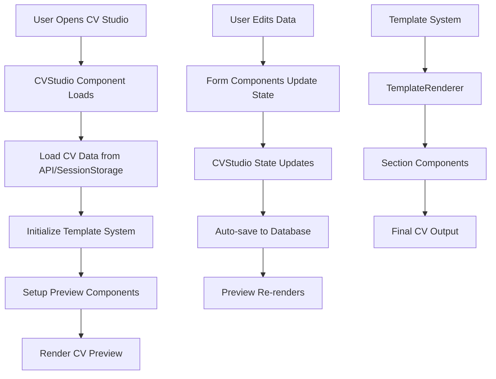

# 📋 Complete CV Data Flow Guide: From Loading to Preview

## 🔄 Data Flow Overview



---

## 📁 Component Architecture

### 1. Main Studio Components

| Component | File Path | Purpose |
|-----------|-----------|---------|
| **CVStudio** | `src/components/studio/CVStudio.tsx` | Main orchestrator, manages all state |
| **PreviewPanel** | `src/components/studio/PreviewPanel.tsx` | Preview wrapper with controls |
| **CVPreview** | `src/components/studio/CVPreview.tsx` | Core preview rendering engine |
| **RestructuredStudioLayout** | `src/components/studio/RestructuredStudioLayout.tsx` | CV editing interface |
| **StructurePanel** | `src/components/studio/panels/StructurePanel.tsx` | Section management panel |

### 2. Template System Components

| Component | File Path | Purpose |
|-----------|-----------|---------|
| **TemplateRenderer** | `src/lib/templates/template-renderer.tsx` | Renders CV using template |
| **Template Components** | `src/components/cv-sections/` | Individual section renderers |

### 3. Form Components

| Component | File Path | Purpose |
|-----------|-----------|---------|
| **PersonalInfoForm** | `src/components/studio/forms/PersonalInfoForm.tsx` | Personal info editing |
| **WorkExperienceSection** | `src/components/studio/forms/WorkExperienceSection.tsx` | Work experience editing |
| **EducationSection** | `src/components/studio/forms/EducationSection.tsx` | Education editing |
| **SkillsSection** | `src/components/studio/forms/SkillsSection.tsx` | Skills editing |
| **ProjectsSection** | `src/components/studio/forms/ProjectsSection.tsx` | Projects editing |

---

## 📊 Data Structures

### 1. UnifiedCVDataStructure
**File:** `src/types/unified-cv-schema.ts`

```typescript
interface UnifiedCVDataStructure {
  // Personal Information
  basics: {
    name: string;
    label: string;
    image: string;
    email: string;
    phone: string;
    url: string;
    summary: string;
    location: { 
      address: string; 
      postalCode: string; 
      city: string; 
      countryCode: string; 
      region: string; 
    };
    profiles: Array<{ 
      network: string; 
      username: string; 
      url: string; 
    }>;
  };
  
  // Work Experience
  work: Array<{
    name: string;
    position: string;
    url: string;
    startDate: string;
    endDate: string;
    summary: string;
    highlights: string[];
  }>;
  
  // Education
  education: Array<{
    institution: string;
    url: string;
    area: string;
    studyType: string;
    startDate: string;
    endDate: string;
    score: string;
    courses: string[];
  }>;
  
  // Skills
  skills: Array<{
    category: string;
    skills: string[];
  }>;
  
  // Projects
  projects: Array<{
    name: string;
    startDate: string;
    endDate: string;
    description: string;
    highlights: string[];
    keywords: string[];
    url: string;
  }>;
  
  // Certificates
  certificates: Array<{
    name: string;
    date: string;
    issuer: string;
    url: string;
    description: string;
  }>;
  
  // Languages
  languages: Array<{
    language: string;
    fluency: string;
  }>;
  
  // Volunteer Experience
  volunteer: Array<{
    organization: string;
    position: string;
    url: string;
    startDate: string;
    endDate: string;
    summary: string;
    highlights: string[];
  }>;
  
  // Awards and Recognition
  awards: Array<{
    title: string;
    date: string;
    awarder: string;
    summary: string;
  }>;
  
  // Publications
  publications: Array<{
    name: string;
    publisher: string;
    releaseDate: string;
    url: string;
    summary: string;
  }>;
  
  // Interests
  interests: Array<{
    name: string;
    keywords: string[];
  }>;
  
  // References
  references: Array<{
    name: string;
    reference: string;
  }>;
}
```

### 2. Template Structure
**File:** `src/models/Template.ts`

```typescript
interface ITemplate {
  name: string;
  description?: string;
  thumbnail?: string;
  category: 'cv' | 'portfolio' | 'cover-letter' | 'resume' | 'custom';
  tier: 'free' | 'premium';
  
  // Layout Configuration
  layoutType: 'one-column' | 'two-column' | 'three-column' | 'custom';
  
  // Global styling
  globalStyles: {
    fontFamily: string;
    primaryColor: string;
    secondaryColor: string;
    backgroundColor: string;
    fontSize: string;
    lineHeight: string;
    spacing: string;
    borderRadius?: string;
    boxShadow?: string;
    customCSS?: string;
  };
  
  // Available sections
  availableSections: ISectionBlueprint[];
  
  // Page settings
  pageSettings?: {
    format: 'A4' | 'Letter' | 'Legal' | 'custom';
    orientation: 'portrait' | 'landscape';
    margins: { 
      top: string; 
      bottom: string; 
      left: string; 
      right: string; 
    };
    maxHeight?: string;
  };
}

interface ISectionBlueprint {
  key: string; // Unique key for this section type
  displayName: string; // Name shown to user in UI
  componentName: string; // Frontend React component to use
  isList: boolean; // If true, can contain multiple items
  defaultItemContent: any; // Default JSON structure for new items
  description?: string; // Optional description for the UI
  icon?: string; // Optional icon identifier
  category?: string; // Optional category for grouping
  maxItems?: number; // Optional maximum number of items
  minItems?: number; // Optional minimum number of items
}
```

---

## 🔄 Detailed Data Flow

### Phase 1: Initialization

```typescript
// 1. CVStudio loads
const CVStudio = ({ cvId, userId, mode }) => {
  const [cvData, setCvData] = useState<UnifiedCVDataStructure | null>(null);
  const [selectedTemplate, setSelectedTemplate] = useState<ITemplate | null>(null);
  
  // 2. Load initial data
  useEffect(() => {
    const loadInitialData = async () => {
      // Check sessionStorage first
      const sessionCVData = sessionStorage.getItem('newCVData');
      
      if (sessionCVData) {
        // Load from session
        const parsedCVData = JSON.parse(sessionCVData);
        setCvData(parsedCVData.cvData);
      } else if (cvId) {
        // Load from API
        const unifiedCV = await UnifiedCVService.getCV(cvId, userId);
        setCvData(unifiedCV.cvData);
      }
      
      // Load templates
      const templatesResult = await TemplateService.getTemplates();
      setSelectedTemplate(templatesResult[0]);
    };
    
    loadInitialData();
  }, [cvId, userId]);
};
```

### Phase 2: Template System

```typescript
// TemplateRenderer processes CV data
const TemplateRenderer = ({ cvData, template, enabledSections }) => {
  // 1. Generate CSS from template
  const templateCSS = generateTemplateCSS(template.globalStyles);
  
  // 2. Map sections to components
  const sectionsToRender = getSectionsToRender(
    template.availableSections,
    sectionOrder,
    sectionVisibility,
    enabledSections
  );
  
  // 3. Render each section
  return (
    <div className="cv-container">
      {sectionsToRender.map((section) => {
        const Component = COMPONENT_REGISTRY[section.componentName];
        const dataKey = SECTION_DATA_MAP[section.key];
        const sectionData = cvData[dataKey];
        
        return (
          <div key={section.key} className="section-content">
            <Component
              data={sectionData}
              sectionConfig={section}
              template={template}
              cvData={cvData}
            />
          </div>
        );
      })}
    </div>
  );
};
```

### Phase 3: Preview Rendering

```typescript
// CVPreview calculates pages and renders
const CVPreview = ({ cvData, template, sectionOrder }) => {
  // 1. Calculate page breaks
  const calculatePages = useMemo(() => {
    const maxPageHeight = (currentDimensions.height - pagePadding.top - pagePadding.bottom) * 0.95;
    const sectionsWithData = sectionOrder.filter(section => hasSectionData(section));
    
    const pages = {};
    let currentPage = 1;
    let currentPageHeight = 0;
    
    for (const section of sectionsWithData) {
      const sectionHeight = getSectionHeight(section);
      
      if (currentPageHeight + sectionHeight > maxPageHeight && pages[currentPage].length > 0) {
        currentPage++;
        pages[currentPage] = [];
        currentPageHeight = 0;
      }
      
      pages[currentPage].push(section);
      currentPageHeight += sectionHeight;
    }
    
    return { pages, totalPages: currentPage };
  }, [cvData, sectionOrder]);
  
  // 2. Render pages
  return (
    <div className="space-y-4">
      {Object.keys(calculatePages.pages).map((pageKey) => {
        const pageSections = calculatePages.pages[parseInt(pageKey)];
        
        return (
          <div key={pageKey} className="bg-white mx-auto relative" style={{
            width: currentDimensions.width,
            minHeight: currentDimensions.height,
            padding: `${pagePadding.top}px ${pagePadding.bottom}px`,
            boxShadow: '0 0 0 1px rgba(0, 0, 0, 0.1), 0 4px 12px rgba(0, 0, 0, 0.1)'
          }}>
            <TemplateRenderer
              cvData={cvData}
              template={template}
              enabledSections={pageSections}
            />
          </div>
        );
      })}
    </div>
  );
};
```

---

## 🎨 Template System Deep Dive

### Template File Types

| File Type | Location | Purpose |
|-----------|----------|---------|
| **Template Model** | `src/models/Template.ts` | MongoDB schema definition |
| **Default Template** | `src/lib/templates/default-template.ts` | Built-in professional template |
| **Template Renderer** | `src/lib/templates/template-renderer.tsx` | Rendering engine |
| **Section Components** | `src/components/cv-sections/` | Individual section renderers |

### Template Components Registry

```typescript
const COMPONENT_REGISTRY = {
  PersonalHeaderSection: PersonalHeader,
  ProfileSection: Profile,
  WorkExperienceSection: WorkExperience,
  EducationSection: Education,
  SkillsSection: Skills,
  ProjectsSection: Projects,
  CertificatesSection: Certificates,
  LanguagesSection: Languages,
  VolunteerSection: Volunteer,
  AwardsSection: Awards,
  PublicationsSection: Publications
};
```

### Section Data Mapping

```typescript
const SECTION_DATA_MAP = {
  personal_header: 'basics',
  work_experience: 'work',
  education: 'education',
  skills: 'skills',
  projects: 'projects',
  certificates: 'certificates',
  languages: 'languages',
  volunteer: 'volunteer',
  awards: 'awards',
  publications: 'publications'
};
```

### Template CSS Generation

```typescript
// Template CSS is generated from globalStyles
const generateTemplateCSS = (globalStyles) => {
  return `
    .cv-container {
      font-family: ${globalStyles.fontFamily};
      font-size: ${globalStyles.fontSize};
      line-height: ${globalStyles.lineHeight};
      background-color: ${globalStyles.backgroundColor};
      color: ${globalStyles.primaryColor};
    }
    
    .section-header {
      font-weight: 700;
      font-size: 12pt;
      color: ${globalStyles.primaryColor};
      text-transform: uppercase;
      letter-spacing: 0.5px;
      margin-bottom: 4px;
      border-bottom: 1px solid ${globalStyles.primaryColor};
      padding-bottom: 2px;
    }
    
    .section-content {
      margin-bottom: ${globalStyles.spacing};
    }
    
    .experience-item, .education-item, .project-item {
      margin-bottom: 18px;
      page-break-inside: avoid;
    }
    
    @media print {
      .cv-container {
        box-shadow: none;
        margin: 0;
        max-width: none;
        padding: 1in;
      }
      
      .section-content {
        page-break-inside: avoid;
      }
      
      .experience-item, .education-item, .project-item {
        page-break-inside: avoid;
        break-inside: avoid;
      }
      
      .section-header {
        page-break-after: avoid;
        break-after: avoid;
      }
    }
  `;
};
```

---

## 🔧 Key Features

### 1. Page Break Logic
- **A4 Height Calculation**: `(1123px - padding) * 0.95`
- **Dynamic Section Heights**: Based on content length
- **CSS Page Breaks**: `page-break-inside: avoid`

```typescript
// Section height estimation
const getSectionHeight = (section: string): number => {
  const baseHeights = {
    personal_header: 150,
    work_experience: Math.max(300, (cvData.work?.length || 0) * 150),
    education: Math.max(200, (cvData.education?.length || 0) * 100),
    skills: Math.max(150, (cvData.skills?.length || 0) * 50),
    projects: Math.max(200, (cvData.projects?.length || 0) * 120),
    certificates: Math.max(150, (cvData.certificates?.length || 0) * 80),
    languages: Math.max(120, (cvData.languages?.length || 0) * 60),
    volunteer: Math.max(150, (cvData.volunteer?.length || 0) * 100),
    awards: Math.max(120, (cvData.awards?.length || 0) * 80),
    publications: Math.max(120, (cvData.publications?.length || 0) * 80),
    interests: Math.max(80, (cvData.interests?.length || 0) * 30),
    references: Math.max(120, (cvData.references?.length || 0) * 80)
  };
  
  return baseHeights[section] || 100;
};
```

### 2. Data Persistence
- **Auto-save**: Debounced saves every 2 seconds
- **Session Storage**: Temporary storage for new CVs
- **Database Sync**: MongoDB with unified schema

```typescript
// Auto-save with debouncing
const debouncedSave = useCallback(
  debounce(async (data: UnifiedCVDataStructure) => {
    if (cvId) {
      await CVService.updateCV(cvId, {
        title: cvTitle,
        cvData: data,
        templateId: selectedTemplate?.id || '',
        metadata: { isMaster: isMasterCV }
      }, userId);
    }
  }, 2000),
  [cvId, cvTitle, selectedTemplate, isMasterCV, userId]
);
```

### 3. Template Customization
- **Global Styles**: Font, colors, spacing
- **Section Styling**: Individual section customization
- **Custom CSS**: Additional styling rules
- **Layout Types**: One-column, two-column, three-column

### 4. Real-time Preview
- **Live Updates**: Changes reflect immediately
- **Zoom Controls**: 50% to 200% zoom range
- **Paper Sizes**: A4 and US Letter support
- **Page Navigation**: Multi-page CV support

---

## 📝 Usage Examples

### Loading CV Data
```typescript
// From API
const cvData = await UnifiedCVService.getCV(cvId, userId);

// From session storage
const sessionData = JSON.parse(sessionStorage.getItem('newCVData'));
```

### Updating CV Data
```typescript
// Update field with proper nested object handling
const updateCVField = (field: string, value: any) => {
  const fieldPath = field.split('.');
  const updatedData = { ...cvData };
  let current: any = updatedData;

  // Safely navigate and create intermediate objects/arrays
  for (let i = 0; i < fieldPath.length - 1; i++) {
    const key = fieldPath[i];
    const nextKey = fieldPath[i + 1];
    
    if (!current[key] || typeof current[key] !== 'object') {
      const isArrayIndex = !isNaN(parseInt(nextKey));
      current[key] = isArrayIndex ? [] : {};
    } else {
      current[key] = Array.isArray(current[key]) ? [...current[key]] : { ...current[key] };
    }
    
    current = current[key];
  }

  current[fieldPath[fieldPath.length - 1]] = value;
  setCvData(updatedData);
  
  // Trigger auto-save
  debouncedSave(updatedData);
};
```

### Rendering with Template
```typescript
<TemplateRenderer
  cvData={cvData}
  template={selectedTemplate}
  sectionOrder={['personal_header', 'work_experience', 'education']}
  enabledSections={pageSections}
  customStyles={{
    height: '100%',
    overflow: 'hidden',
    pageBreakInside: 'avoid',
    breakInside: 'avoid'
  }}
/>
```

### Form Component Integration
```typescript
// PersonalInfoForm usage
<PersonalInfoForm
  data={cvData?.basics || {}}
  onUpdate={(field, value) => {
    if (onUpdateField) {
      onUpdateField(`basics.${field}`, value);
    } else {
      onUpdateCV?.({ ...cvData, basics: { ...cvData?.basics, [field]: value } });
    }
  }}
  cvData={cvData}
  jobData={jobContext}
  userId={userId}
/>

// WorkExperienceSection usage
<WorkExperienceSection
  data={cvData?.work || []}
  onUpdate={(path, value) => {
    if (onUpdateField) {
      onUpdateField(path, value);
    } else {
      onUpdateCV?.({ ...cvData, work: data });
    }
  }}
  onAdd={() => {
    const newWork = [...(cvData?.work || []), {
      name: '', position: '', startDate: '', endDate: '', summary: '', highlights: []
    }];
    if (onUpdateField) {
      onUpdateField('work', newWork);
    } else {
      onUpdateCV?.({ ...cvData, work: newWork });
    }
  }}
  onRemove={(index) => {
    const newWork = (cvData?.work || []).filter((_, i) => i !== index);
    if (onUpdateField) {
      onUpdateField('work', newWork);
    } else {
      onUpdateCV?.({ ...cvData, work: newWork });
    }
  }}
  jobData={jobContext}
  userId={userId}
/>
```

---

## 🚀 Advanced Features

### 1. ATS (Applicant Tracking System) Integration
- **ATS Score Calculation**: Real-time scoring based on job requirements
- **Keyword Matching**: Skills and experience matching
- **Format Optimization**: ATS-friendly formatting

### 2. Master CV System
- **Master CV Creation**: Comprehensive CV with all sections
- **Job-Specific CVs**: Generated from master CV for specific jobs
- **Smart Suggestions**: AI-powered content suggestions

### 3. Multi-Format Export
- **PDF Export**: High-quality PDF generation
- **DOCX Export**: Microsoft Word compatible format
- **PNG Export**: Image format for sharing

### 4. Real-time Collaboration
- **Live Editing**: Multiple users can edit simultaneously
- **Version Control**: Track changes and revisions
- **Comments System**: Collaborative feedback

---

## 🔍 Debugging and Troubleshooting

### Common Issues

1. **Data Loss During Editing**
   - **Cause**: Incorrect `updateCVField` implementation
   - **Solution**: Use proper nested object creation logic

2. **Page Break Issues**
   - **Cause**: Incorrect height calculations
   - **Solution**: Check `getSectionHeight` and `calculatePages` functions

3. **Template Rendering Problems**
   - **Cause**: Missing component in registry
   - **Solution**: Verify `COMPONENT_REGISTRY` mapping

4. **CSS Conflicts**
   - **Cause**: Template CSS overriding component styles
   - **Solution**: Use CSS specificity or `!important` declarations

### Debug Tools

```typescript
// Enable debug logging
console.log('📄 CVPreview - Page calculation:', {
  maxPageHeight,
  sectionsWithData,
  pages,
  totalPages: currentPage,
  pageHeights: Object.keys(pages).map(pageNum => ({
    page: pageNum,
    sections: pages[parseInt(pageNum)],
    height: pages[parseInt(pageNum)].reduce((sum, section) => sum + getSectionHeight(section), 0)
  }))
});

// Check data structure
console.log('🔍 PersonalInfoForm - data:', data);
console.log('🔍 PersonalInfoForm - cvData:', cvData);
```

---

## 📚 Additional Resources

### Related Files
- `src/lib/services/unified-cv-service.ts` - CV data API service
- `src/lib/services/templateService.ts` - Template management service
- `src/lib/utils/cvNamingUtils.ts` - CV naming utilities
- `src/lib/section-mapping.ts` - Section order mapping

### Database Collections
- **CVs**: Store CV documents with unified structure
- **Templates**: Store template definitions and styles
- **Users**: User profiles and preferences
- **Jobs**: Job postings for ATS matching

### API Endpoints
- `GET /api/cvs/[id]` - Retrieve CV data
- `PUT /api/cvs/[id]` - Update CV data
- `POST /api/cvs` - Create new CV
- `GET /api/templates` - Get available templates
- `GET /api/jobs/[id]` - Get job data for ATS matching

---

This comprehensive guide covers the entire CV data flow from loading to preview, including all components, data structures, template system architecture, and advanced features!
