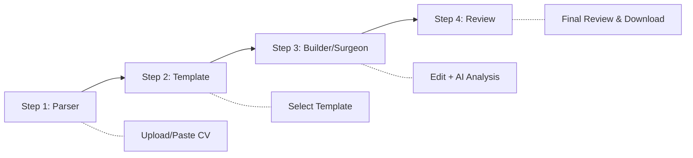
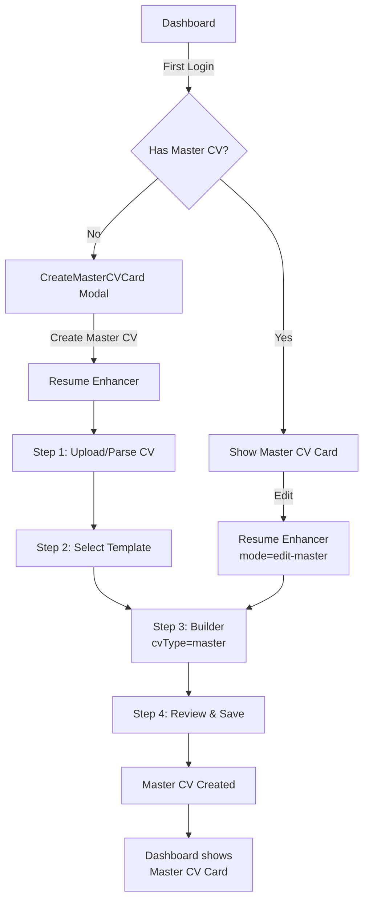
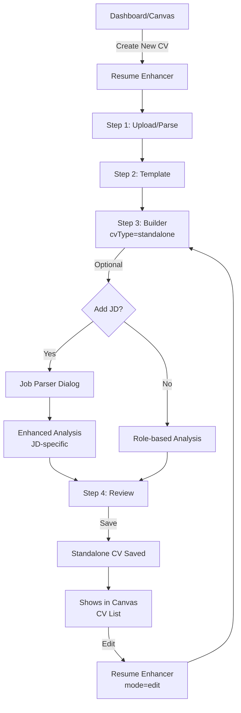
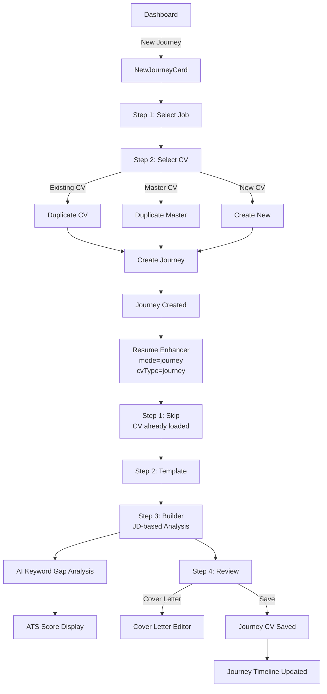
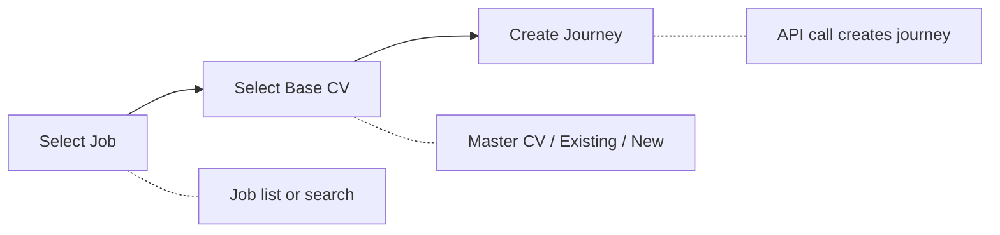
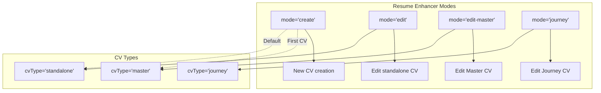

# CV Creation Flows Guide

This document provides a detailed guide on how different CV creation flows work in CVCircle, covering Master, Standalone, and Journey CVs.

---

## Overview of CV Types

| CV Type | Purpose | Entry Point | JD Required | ATS Optimization |
|---------|---------|-------------|-------------|------------------|
| **Master CV** | Foundation CV with complete career history | Dashboard → "Create Master CV" | No | General best practices |
| **Standalone CV** | Quick CV for general use | Resume Enhancer (no job context) | Optional | Optional if JD provided |
| **Journey CV** | Job-specific tailored CV | Dashboard → "New Journey" or Job Card | Yes | Full JD-based keywords |

---

## Resume Enhancer Steps

All CV creation flows share the same 4-step Resume Enhancer:



### Step 1: Parser (`Step1Parser.tsx`)
**Purpose:** Import CV data from file or manual entry

**Components:**
- File upload zone (PDF, DOCX)
- Paste text area
- LinkedIn import option
- JSON Resume import

**Buttons:**
- **Upload CV** - Opens file picker
- **Paste Text** - Switches to text input mode
- **Continue** - Proceeds to Step 2

---

### Step 2: Template (`Step2Template.tsx`)
**Purpose:** Select visual template

**Components:**
- Template grid with thumbnails
- Tier badges (Free/Premium)
- ATS compatibility indicators (for Journey CVs)

**Buttons:**
- **Template cards** - Clickable to select
- **Continue with [Template Name]** - Confirms and proceeds

---

### Step 3: Builder/Surgeon (`Step3BuilderSurgeon.tsx`)
**Purpose:** Edit CV with AI-powered suggestions

**Components:**
- CV Preview (left pane)
- Floating Form Editor (right pane)
- Sidebar navigation (sections)
- AI Fix annotations
- ATS/CV Score display

**Buttons:**
- **Save** - Saves current progress
- **Section buttons** - Navigate between CV sections
- **AI Fix** - Apply suggested improvements
- **Dismiss** - Ignore suggestions
- **ATS View** - Toggle ATS parse preview
- **Recruiter View** - Toggle recruiter heatmap
- **Page Size** - Switch A4/Letter
- **Zoom controls** - Adjust preview scale

---

### Step 4: Review (`Step4Review.tsx`)
**Purpose:** Final review and export

**Components:**
- Final CV preview
- Score breakdowns
- Download options
- Cover Letter integration

**Buttons:**
- **Download PDF** - Export as PDF
- **Download DOCX** - Export as Word
- **Cover Letter** - Open/Generate cover letter
- **Back to Editor** - Return to Step 3

---

## Master CV Flow

Master CV is the user's comprehensive career document, serving as the foundation for all job-specific CVs.

### Entry Points:
1. **Dashboard Onboarding** - `CreateMasterCVCard.tsx` modal appears for first-time users
2. **Side Navigation** - "Create Master CV" link
3. **URL** - `/resume-enhancer` (with `fromOnboarding=true` flag)

### Flow Diagram:



### Key Behaviors:
- **CV Type:** `'master'`
- **Mode:** `'create'` → `'edit-master'` after save
- **Score Label:** "CV Score" (not ATS Score)
- **Analysis:** Role-based optimization without JD
- **Limit:** One Master CV per user

### Components Involved:
| Component | Role |
|-----------|------|
| `CreateMasterCVCard.tsx` | Onboarding modal |
| `MasterCVCardOverlay.tsx` | Dashboard card display |
| `MasterCVBadge.tsx` | Badge indicator |
| `Canvas.tsx` | Dashboard canvas hosting cards |

---

## Standalone CV Flow

Standalone CVs are quick, general-purpose CVs not tied to a specific job application.

### Entry Points:
1. **Resume Enhancer URL** - `/resume-enhancer` (no journey context)
2. **Dashboard** - "Create New CV" or Plus button
3. **Canvas** - CVCardOverlay → Edit

### Flow Diagram:



### Key Behaviors:
- **CV Type:** `'standalone'`
- **Mode:** `'create'` → `'edit'`
- **Score Label:** "CV Score" (unless JD attached)
- **Analysis:** Role-based, or JD-specific if provided
- **Optional JD:** Can paste JD for better optimization

### Components Involved:
| Component | Role |
|-----------|------|
| `CVCardOverlay.tsx` | Dashboard card display |
| `CVListView.tsx` | List view in Canvas |
| `JobParserDialog.tsx` | Optional JD input |

---

## Journey CV Flow

Journey CVs are job-specific, tailored CVs created as part of an Application Journey.

### Entry Points:
1. **New Journey Card** - `NewJourneyCard.tsx` wizard
2. **Job Card** - Click job → "Start Journey"
3. **Journey Timeline** - Edit journey CV button
4. **Canvas** - Journey-linked CV cards

### Flow Diagram:



### Journey Creation Steps (NewJourneyCard):



### Key Behaviors:
- **CV Type:** `'journey'`
- **Mode:** `'journey'`
- **Score Label:** "ATS Score" (JD-specific)
- **Analysis:** Full JD-based keyword optimization
- **ATS Score Cap:** Based on template selection
- **Cover Letter:** Auto-generated from JD + CV

### Components Involved:
| Component | Role |
|-----------|------|
| `NewJourneyCard.tsx` | Journey creation wizard |
| `JourneyTimelineCard.tsx` | Journey status/actions |
| `ApplicationTracker.tsx` | Track all journeys |
| `JobSidebar.tsx` | Job details panel |
| `CoverLetterEditorContainer.tsx` | Cover letter editing |

---

## Mode Comparison



---

## Container Props Reference

```typescript
interface ResumeEnhancerContainerProps {
  userId: string;
  mode?: 'create' | 'edit' | 'edit-master' | 'journey';
  cvId?: string;           // For edit modes
  journeyId?: string;      // For journey mode
  isGuestMode?: boolean;   // Guest user flow
  restoreDraft?: boolean;  // Restore saved draft
}
```

---

## Dashboard Components Reference

| Component | File | Purpose |
|-----------|------|---------|
| Canvas | `Canvas.tsx` | Main dashboard workspace |
| CV Card | `CVCardOverlay.tsx` | Standalone CV display |
| Master CV Card | `MasterCVCardOverlay.tsx` | Master CV display |
| Cover Letter Card | `CoverLetterCardOverlay.tsx` | Cover letter display |
| New Journey | `NewJourneyCard.tsx` | Journey creation wizard |
| Journey Timeline | `JourneyTimelineCard.tsx` | Journey progress display |
| Job Sidebar | `JobSidebar.tsx` | Job details drawer |
| CV List View | `CVListView.tsx` | Grid/list of CVs |
