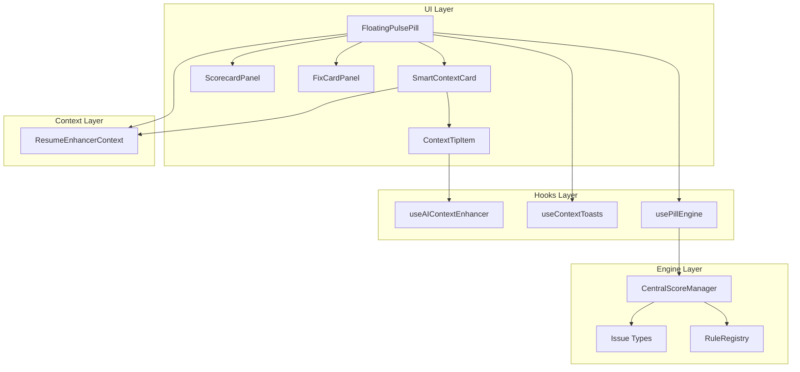
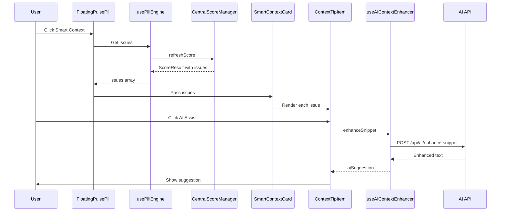

# AI Service Components Analysis & Fix Plan

## Overview

This document analyzes the AI service components in the resume-enhancer feature, including the FloatingPulsePill, SmartContextCard, panels, and their integration with the pill-engine and AI services.

---

## Component Architecture



---

## Identified Issues

### P1 - Critical Issues

#### 1. AI Context Enhancer is Mocked
**File**: [`src/hooks/useAIContextEnhancer.ts`](src/hooks/useAIContextEnhancer.ts:45-55)

**Problem**: The AI enhancement hook has a mock implementation that returns hardcoded responses:
```typescript
// Mock Response Simulation
await new Promise(resolve => setTimeout(resolve, 1500));
const mockResponse = `Refined: ${snippet} (Enhanced with impact metrics and strong verbs)`;
```

**Impact**: The AI Assist button in ContextTipItem does nothing useful - users clicking it get fake responses.

**Fix**: Connect to actual AI API using the existing gemini-api-helper or AI routes.

---

### P2 - High Priority Issues

#### 2. Duplicate Score Calculation Logic
**Files**: 
- [`src/hooks/usePillEngine.ts`](src/hooks/usePillEngine.ts:35-52)
- [`src/components/resume-enhancer/FloatingPulsePill.tsx`](src/components/resume-enhancer/FloatingPulsePill.tsx:310-316)

**Problem**: Score calculation happens in multiple places with different logic:
- `usePillEngine` returns `masterScore`, `atsScore`, `healthScore`
- `FloatingPulsePill` has its own display logic: `displayScore` with conditional logic for journey vs master CVs

**Impact**: Score inconsistencies between what the engine calculates and what the UI displays.

**Fix**: Consolidate all score display logic into the hook, expose a single `displayScore` value.

---

#### 3. Complex Issue Mapping in FloatingPulsePill
**File**: [`src/components/resume-enhancer/FloatingPulsePill.tsx`](src/components/resume-enhancer/FloatingPulsePill.tsx:117-172)

**Problem**: The mapping from `fixAnnotations` to `Issue` type is complex and error-prone:
```typescript
const surgicalIssues: Issue[] = state.fixAnnotations
    .filter(f => f.status === 'open')
    .map(fix => {
        // Complex mapping logic with hardcoded section maps
        const sectionMap: Record<string, any> = { ... };
        // ...
    });
```

**Impact**: 
- Section mapping may be incorrect for edge cases
- Category/severity mapping is approximate
- Maintenance burden

**Fix**: Create a dedicated `SurgicalFixToIssueAdapter` service.

---

#### 4. Stale Closure Problem with Fix Callback
**File**: [`src/components/resume-enhancer/FloatingPulsePill.tsx`](src/components/resume-enhancer/FloatingPulsePill.tsx:88-92)

**Problem**: Uses ref pattern to avoid stale closures during async fix loop:
```typescript
const onApplyFixRef = useRef(onApplyFix);
useEffect(() => {
    onApplyFixRef.current = onApplyFix;
}, [onApplyFix]);
```

**Impact**: This is a workaround for a deeper issue - the fix loop should use proper state management.

**Fix**: Move fix queue processing to context or a dedicated hook with proper state management.

---

### P3 - Medium Priority Issues

#### 5. Context Toast Memory Management
**File**: [`src/hooks/useContextToasts.ts`](src/hooks/useContextToasts.ts:17-19)

**Problem**: Toast IDs and dismissed issues are stored in refs/useState but the dismissed set grows unbounded:
```typescript
const [dismissedIssueIds, setDismissedIssueIds] = useState<Set<string>>(new Set());
```

**Impact**: Memory leak for long-running sessions with many issues.

**Fix**: Add cleanup logic or use LRU-style limit on dismissed issues.

---

#### 6. Hardcoded Debounce Times
**File**: [`src/hooks/usePillEngine.ts`](src/hooks/usePillEngine.ts:10-11)

**Problem**: Debounce times are hardcoded:
```typescript
const QUIET_MODE_DEBOUNCE_MS = 2000;
const ACTIVE_MODE_DEBOUNCE_MS = 800;
```

**Impact**: Not configurable for different environments or user preferences.

**Fix**: Make debounce times configurable via PillConfig.

---

#### 7. Missing Error State in AI Enhancer
**File**: [`src/hooks/useAIContextEnhancer.ts`](src/hooks/useAIContextEnhancer.ts:57-61)

**Problem**: Errors are caught but not exposed to UI:
```typescript
catch (error) {
    console.error("AI Context Enhancement failed:", error);
}
```

**Impact**: Users dont know when AI enhancement fails.

**Fix**: Add `error` state and expose it.

---

#### 8. AI Enhancer Loading State Not Used
**File**: [`src/components/resume-enhancer/panels/ContextTipItem.tsx`](src/components/resume-enhancer/panels/ContextTipItem.tsx:74-82)

**Problem**: The `isEnhancing` state from `useAIContextEnhancer` is not connected to the AI Assist button:
```typescript
<button
    onClick={() => onAiAssist(issue)}
    className="..."  // No loading state indicator
>
    <Sparkles size={10} />
    <span>AI Assist</span>
</button>
```

**Impact**: No visual feedback when AI is processing.

**Fix**: Pass loading state through and show spinner.

---

### P4 - Low Priority Issues

#### 9. Duplicate Issue Type in Types
**File**: [`src/lib/pill-engine/types.ts`](src/lib/pill-engine/types.ts:62-63)

**Problem**: Duplicate type definition:
```typescript
| 'XYZ_FORMULA_SUGGESTION'
| 'XYZ_FORMULA_SUGGESTION'  // Duplicate!
```

**Impact**: Code cleanliness, potential confusion.

**Fix**: Remove duplicate.

---

#### 10. CentralScoreManager Singleton Pattern
**File**: [`src/lib/pill-engine/CentralScoreManager.ts`](src/lib/pill-engine/CentralScoreManager.ts:195-202)

**Problem**: Singleton pattern makes testing difficult:
```typescript
public static getInstance(): CentralScoreManager {
    if (!CentralScoreManager.instance) {
        CentralScoreManager.instance = new CentralScoreManager();
    }
    return CentralScoreManager.instance;
}
```

**Impact**: Hard to mock/reset state between tests.

**Fix**: Add `resetInstance()` method for testing, or use dependency injection.

---

## Recommended Fixes

### Phase 1: Critical Fixes

1. **Implement Real AI Enhancement**
   - Create API route `/api/ai/enhance-snippet` if not exists
   - Connect `useAIContextEnhancer` to real AI service
   - Add proper error handling and loading states

### Phase 2: Architecture Improvements

2. **Create SurgicalFixToIssueAdapter**
   - Centralized mapping logic
   - Type-safe conversions
   - Unit testable

3. **Consolidate Score Display Logic**
   - Move all score logic to `usePillEngine`
   - Expose single `displayScore` computed value
   - Remove duplicate calculations from components

4. **Move Fix Queue to Context**
   - Add fix queue state to ResumeEnhancerContext
   - Create `useFixQueue` hook for processing
   - Eliminate stale closure issues

### Phase 3: Polish

5. **Add Error States to UI**
   - Show error toast when AI enhancement fails
   - Add retry button
   - Log errors properly

6. **Improve Loading States**
   - Add spinner to AI Assist button
   - Disable button during processing
   - Show progress indicator

7. **Memory Management**
   - Add max limit to dismissed issues set
   - Clear old toasts on unmount
   - Consider using WeakMap for issue tracking

---

## Component Communication Flow



---

## Files to Modify

| File | Changes |
|------|---------|
| `src/hooks/useAIContextEnhancer.ts` | Connect to real API, add error state |
| `src/hooks/usePillEngine.ts` | Add displayScore, configurable debounce |
| `src/components/resume-enhancer/FloatingPulsePill.tsx` | Remove duplicate logic, use consolidated scores |
| `src/components/resume-enhancer/panels/ContextTipItem.tsx` | Add loading state |
| `src/components/resume-enhancer/panels/SmartContextCard.tsx` | Add error handling |
| `src/lib/pill-engine/types.ts` | Remove duplicate type |
| `src/lib/pill-engine/CentralScoreManager.ts` | Add reset method for testing |
| `src/lib/services/surgicalFixToIssueAdapter.ts` | NEW: Create adapter service |
| `src/app/api/ai/enhance-snippet/route.ts` | NEW: API endpoint if not exists |

---

## Testing Recommendations

1. **Unit Tests for CentralScoreManager**
   - Test score calculations in isolation
   - Test issue generation
   - Test singleton reset

2. **Integration Tests for usePillEngine**
   - Test debounce behavior
   - Test score updates on CV changes
   - Test issue filtering

3. **E2E Tests for AI Enhancement Flow**
   - Test AI Assist button click
   - Test loading states
   - Test error handling