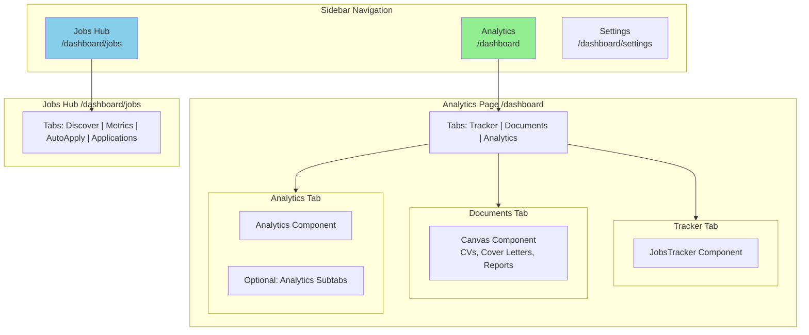

# Plan: Consolidate Analytics, Tracker, and Documents into Single Page

## Overview
Consolidate Analytics, Tracker (default), and Documents into a single page as tabs while maintaining subpages like Cover Letter and CV in Documents. This creates two main pages: **Analytics** and **Jobs** (jobs hub).

## Current Structure

```
/dashboard           → Analytics component
/dashboard/jobs     → JobsDashboard (Jobs hub)
/dashboard/tracker  → JobsTracker component  
/dashboard/canvas   → Canvas component (Documents)
```

## Target Structure

```
/dashboard           → AnalyticsPage with tabs (default: tracker)
/dashboard/jobs     → JobsDashboard (unchanged - Jobs hub)
```

### Analytics Page Tabs
| Tab | Default | Content | URL |
|-----|---------|---------|-----|
| Tracker | ✓ | JobsTracker component | `/dashboard?tab=tracker` |
| Documents | | Canvas component (no subtabs) | `/dashboard?tab=documents` |
| Analytics | | Analytics component | `/dashboard?tab=analytics` |

### Jobs Page (Unchanged)
| Tab | Content |
|-----|---------|
| Discover | JobDiscoveryPanel |
| Metrics | Charts/Metrics |
| AutoApply | AutoApplyPanel |
| Applications | ApplicationsPanel |

---

## Implementation Steps

### Step 1: Create Consolidated Analytics Page Component

**File:** `src/app/dashboard/page.tsx`

- Replace simple Analytics import with consolidated page
- Implement tab state management with URL query parameter sync
- Default tab: `tracker`

```typescript
// Tab state
const [activeTab, setActiveTab] = useState<'tracker' | 'documents' | 'analytics'>('tracker');

// URL sync (hybrid approach)
// - Internal tab switching uses state for performance
// - URL updates for deep linking and browser history
// - On page load, read from URL params or default to 'tracker'
```

### Step 2: Create Tab Navigation Component

**File:** `src/components/dashboard/AnalyticsTabs.tsx` (new)

- Tab bar with three options: Tracker, Documents, Analytics
- Active state styling
- Click handlers that:
  1. Update internal state (instant UI change)
  2. Update URL with query param (for deep linking)

### Step 3: Integrate Child Components

**Tracker Tab:**
- Import and render `JobsTracker` component
- Keep existing `/dashboard/tracker` route for backward compatibility (optional: redirect to `/dashboard?tab=tracker`)

**Documents Tab:**
- Import and render `Canvas` component
- No subtabs - clicking navigates directly to Canvas
- Keep existing `/dashboard/canvas` route for backward compatibility

**Analytics Tab:**
- Import and render existing `Analytics` component
- Can optionally add subtabs here (e.g., Overview, Performance, Trends)

### Step 4: Update Navigation

**File:** `src/components/dashboard/OptimizedNavigation.tsx`

- Update `sections` array:
  - Remove separate `tracker` entry
  - Remove separate `canvas` (Documents) entry  
  - Keep `analytics` pointing to `/dashboard`
  - Keep `jobs-dashboard` pointing to `/dashboard/jobs`

- Update `routes` mapping:
  ```typescript
  const routes = {
    'analytics': '/dashboard',        // Consolidated page
    'jobs': '/dashboard/jobs',        // Jobs hub (unchanged)
  };
  ```

- Update `pathname` detection in `useEffect`:
  ```typescript
  useEffect(() => {
    const tab = searchParams.get('tab');
    if (pathname === '/dashboard') {
      if (!tab || tab === 'tracker') {
        setActiveSection('analytics'); // Tracker is default
      } else {
        setActiveSection(tab);
      }
    } else if (pathname.includes('/jobs')) {
      setActiveSection('jobs');
    } else if (pathname.includes('/settings')) {
      setActiveSection('settings');
    }
  }, [pathname, searchParams]);
  ```

### Step 5: Handle Backward Compatibility (Optional)

Keep existing routes working with redirects:

- `/dashboard/tracker` → `/dashboard?tab=tracker`
- `/dashboard/canvas` → `/dashboard?tab=documents`

OR add middleware to handle old routes.

---

## URL Strategy (Hybrid Approach)

### Benefits
- **Fast tab switching:** Use React state for instant UI updates
- **Deep linking:** URL reflects current tab for sharing/bookmarking
- **Browser history:** Back/forward buttons work correctly
- **SEO:** Each tab has distinct URL

### Implementation
```typescript
const handleTabChange = (tab: string) => {
  // 1. Instant UI update
  setActiveTab(tab as TabType);
  
  // 2. Update URL without full page reload
  const params = new URLSearchParams(searchParams);
  params.set('tab', tab);
  router.replace(`/dashboard?${params.toString()}`, { scroll: false });
};

// On page load, read from URL or default
useEffect(() => {
  const tab = searchParams.get('tab');
  if (tab && ['tracker', 'documents', 'analytics'].includes(tab)) {
    setActiveTab(tab as TabType);
  } else {
    setActiveTab('tracker'); // Default
  }
}, [searchParams]);
```

---

## Component Architecture

```
src/app/dashboard/
├── page.tsx                    # Consolidated AnalyticsPage with tabs
├── layout.tsx                  # Unchanged (dashboard layout)
├── jobs/
│   └── page.tsx               # Unchanged (Jobs hub)
├── tracker/
│   └── page.tsx               # Keep for backward compatibility (optional redirect)
└── canvas/
    └── page.tsx               # Keep for backward compatibility (optional redirect)

src/components/dashboard/
├── AnalyticsPage.tsx           # NEW: Main consolidated component
├── AnalyticsTabs.tsx          # NEW: Tab navigation UI
├── Analytics.tsx              # Existing - used as Analytics tab
├── JobsTracker.tsx             # Existing - used as Tracker tab
├── Canvas.tsx                  # Existing - used as Documents tab
├── OptimizedNavigation.tsx    # MODIFIED: Updated navigation items
└── JobsDashboard.tsx          # Unchanged
```

---

## Mermaid Diagram: New Navigation Structure



---

## Summary

| Aspect | Current | New |
|--------|---------|-----|
| Main Pages | 4 (Analytics, Jobs, Tracker, Canvas) | 2 (Analytics, Jobs) |
| Analytics Subpages | Separate routes | Tabs on /dashboard |
| Tracker | `/dashboard/tracker` | `/dashboard?tab=tracker` |
| Documents | `/dashboard/canvas` | `/dashboard?tab=documents` |
| Jobs Hub | `/dashboard/jobs` | Unchanged |
| URL for default | `/dashboard` | `/dashboard?tab=tracker` |

---

## Next Steps

1. Create `AnalyticsPage` component with tab structure
2. Create `AnalyticsTabs` navigation component
3. Update `/dashboard/page.tsx` to use new component
4. Update `OptimizedNavigation.tsx` to remove duplicate menu