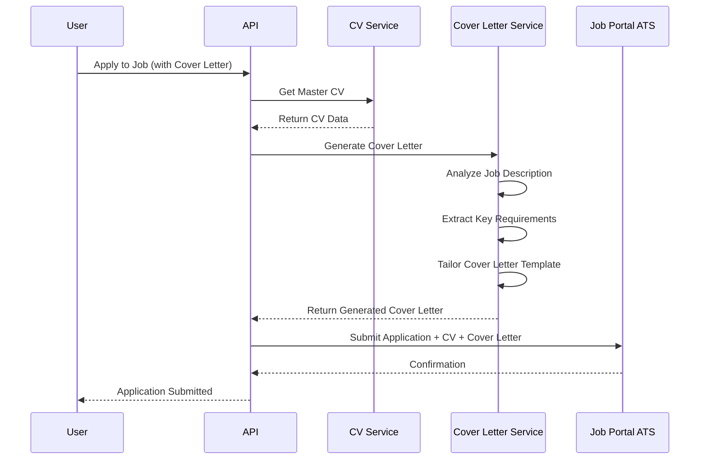
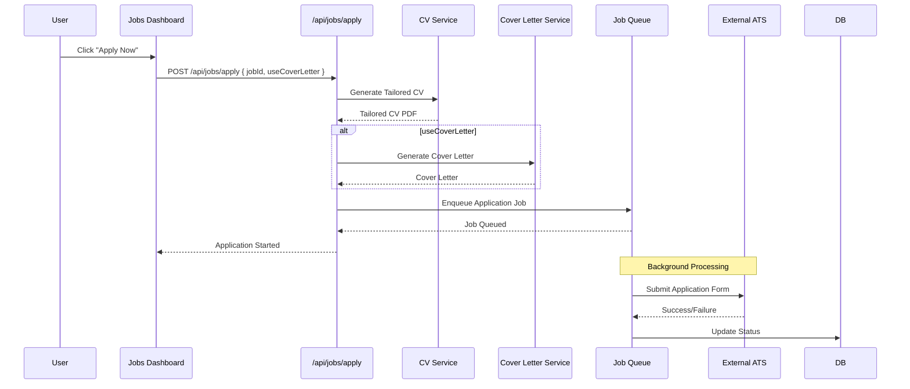

# Enhanced Jobs Page - Unified Dashboard Architecture

## Project Overview

**Document Type:** Technical Architecture Specification  
**Version:** 2.0  
**Date:** 2026-03-16  
**Status:** Updated for Unified Dashboard  

---

## Executive Summary

This document outlines the complete system architecture for enhancing the CV Circle jobs page with a **unified, seamless dashboard** that combines:
- Jobs Discovery (portal integration)
- Smart Job Matching (CV-based relevance)
- Auto-Apply with Cover Letter Integration
- Application History & Analytics
- All in one page with dark/light theming matching the app

**Initial Region:** UK and India (easily expandable)

---

## 1. Unified Dashboard Architecture

### 1.1 Layout Overview

```mermaid
graph TB
    subgraph "Unified Jobs Dashboard"
        subgraph "Top Bar"
            Q[Quota Indicator<br/>50/hr | 100/day]
            R[Region Selector<br/>UK/India]
            S[Auto-Apply Toggle]
        end
        
        subgraph "Main Content - Tabbed Interface"
            T1[🔍 Discover Jobs]
            T2[⚡ Auto-Apply]
            T3[📋 Applications]
            T4[⚙️ Settings]
        end
        
        subgraph "Discover Jobs Tab"
            A[Search & Filters]
            B[Job Cards Grid]
            C[Relevance Score]
            D[Quick Apply Button]
        end
        
        subgraph "Auto-Apply Tab"
            E[Job Preferences]
            F[Target Roles]
            G[Auto-Apply Status]
            H[Running Applications]
        end
        
        subgraph "Applications Tab"
            I[Application History]
            J[Status Timeline]
            K[Success Rates]
        end
    end
```

---

## 2. UI/UX Specification

### 2.1 Page Structure

The dashboard uses a **tabbed interface** to organize all features in one seamless page:

```tsx
// Enhanced src/app/dashboard/jobs/page.tsx

export default function UnifiedJobsDashboard() {
  return (
    <div className="min-h-screen bg-[#f3f2ee] dark:bg-[#1a230f] p-4 lg:p-6">
      {/* Header with Quota & Controls */}
      <DashboardHeader className="mb-6">
        <div className="flex items-center justify-between">
          <h1 className="text-2xl font-bold text-gray-900 dark:text-white">
            Job Finder
          </h1>
          <div className="flex items-center gap-4">
            <QuotaIndicator />
            <RegionSelector />
            <AutoApplyToggle />
          </div>
        </div>
      </DashboardHeader>

      {/* Tabbed Interface */}
      <Tabs defaultValue="discover" className="space-y-4">
        <TabsList className="border-b border-gray-200 dark:border-gray-700">
          <TabsTrigger value="discover">Discover Jobs</TabsTrigger>
          <TabsTrigger value="autoapply">Auto-Apply</TabsTrigger>
          <TabsTrigger value="applications">Applications</TabsTrigger>
          <TabsTrigger value="settings">Settings</TabsTrigger>
        </TabsList>

        {/* Tab 1: Discover Jobs */}
        <TabsContent value="discover">
          <JobDiscoveryPanel />
        </TabsContent>

        {/* Tab 2: Auto-Apply */}
        <TabsContent value="autoapply">
          <AutoApplyPanel />
        </TabsContent>

        {/* Tab 3: Applications */}
        <TabsContent value="applications">
          <ApplicationsPanel />
        </TabsContent>

        {/* Tab 4: Settings */}
        <TabsContent value="settings">
          <SettingsPanel />
        </TabsContent>
      </Tabs>
    </div>
  );
}
```

### 2.2 Theming System

Based on existing CV Circle patterns:

| Element | Light Mode | Dark Mode |
|---------|------------|-----------|
| Page Background | `bg-[#f3f2ee]` | `dark:bg-[#1a230f]` |
| Card Background | `bg-white` | `dark:bg-[#141810]` |
| Secondary BG | `bg-gray-50` | `dark:bg-[#313a28]` |
| Primary Text | `text-gray-900` | `dark:text-white` |
| Secondary Text | `text-gray-600` | `dark:text-gray-300` |
| Muted Text | `text-gray-500` | `dark:text-gray-400` |
| Border | `border-gray-200` | `dark:border-white/10` |
| Accent (Primary) | `text-lime-500` | `text-lime-400` |
| Success | `text-green-600` | `dark:text-green-400` |
| Warning | `text-yellow-600` | `dark:text-yellow-400` |
| Error | `text-red-600` | `dark:text-red-400` |

---

## 3. Component Specifications

### 3.1 Quota Indicator Component

```tsx
// src/components/jobs/QuotaIndicator.tsx

interface QuotaIndicatorProps {
  hourlyUsed: number;
  hourlyLimit: number;
  dailyUsed: number;
  dailyLimit: number;
}

export function QuotaIndicator({ hourlyUsed, hourlyLimit, dailyUsed, dailyLimit }: QuotaIndicatorProps) {
  const hourlyPercent = (hourlyUsed / hourlyLimit) * 100;
  const dailyPercent = (dailyUsed / dailyLimit) * 100;

  return (
    <div className="flex items-center gap-4 bg-white dark:bg-[#141810] border border-gray-200 dark:border-white/10 rounded-lg px-4 py-2">
      {/* Hourly Quota */}
      <div className="flex items-center gap-2">
        <Clock className="w-4 h-4 text-gray-500 dark:text-gray-400" />
        <span className="text-sm text-gray-600 dark:text-gray-300">
          {hourlyUsed}/{hourlyLimit}
        </span>
        <div className="w-16 h-2 bg-gray-200 dark:bg-gray-700 rounded-full overflow-hidden">
          <div 
            className={`h-full rounded-full ${
              hourlyPercent > 80 ? 'bg-red-500' : 
              hourlyPercent > 50 ? 'bg-yellow-500' : 'bg-lime-500'
            }`}
            style={{ width: `${hourlyPercent}%` }}
          />
        </div>
      </div>

      {/* Divider */}
      <div className="w-px h-6 bg-gray-200 dark:bg-gray-700" />

      {/* Daily Quota */}
      <div className="flex items-center gap-2">
        <Calendar className="w-4 h-4 text-gray-500 dark:text-gray-400" />
        <span className="text-sm text-gray-600 dark:text-gray-300">
          {dailyUsed}/{dailyLimit}
        </span>
        <div className="w-16 h-2 bg-gray-200 dark:bg-gray-700 rounded-full overflow-hidden">
          <div 
            className={`h-full rounded-full ${
              dailyPercent > 80 ? 'bg-red-500' : 
              dailyPercent > 50 ? 'bg-yellow-500' : 'bg-lime-500'
            }`}
            style={{ width: `${dailyPercent}%` }}
          />
        </div>
      </div>
    </div>
  );
}
```

### 3.2 Region Selector Component

```tsx
// src/components/jobs/RegionSelector.tsx

interface RegionSelectorProps {
  value: 'UK' | 'India';
  onChange: (region: 'UK' | 'India') => void;
}

export function RegionSelector({ value, onChange }: RegionSelectorProps) {
  return (
    <div className="flex items-center gap-1 bg-gray-100 dark:bg-[#313a28] rounded-lg p-1">
      <button
        onClick={() => onChange('UK')}
        className={`px-3 py-1.5 text-sm font-medium rounded-md transition-colors ${
          value === 'UK'
            ? 'bg-white dark:bg-[#141810] text-gray-900 dark:text-white shadow-sm'
            : 'text-gray-600 dark:text-gray-400 hover:text-gray-900 dark:hover:text-white'
        }`}
      >
        🇬🇧 UK
      </button>
      <button
        onClick={() => onChange('India')}
        className={`px-3 py-1.5 text-sm font-medium rounded-md transition-colors ${
          value === 'India'
            ? 'bg-white dark:bg-[#141810] text-gray-900 dark:text-white shadow-sm'
            : 'text-gray-600 dark:text-gray-400 hover:text-gray-900 dark:hover:text-white'
        }`}
      >
        🇮🇳 India
      </button>
    </div>
  );
}
```

### 3.3 Job Card Component

```tsx
// src/components/jobs/JobCard.tsx

interface JobCardProps {
  job: JobListing;
  relevanceScore: number;
  onApply: (jobId: string) => void;
  onSave: (jobId: string) => void;
}

export function JobCard({ job, relevanceScore, onApply, onSave }: JobCardProps) {
  return (
    <div className="bg-white dark:bg-[#141810] border border-gray-200 dark:border-white/10 rounded-xl p-4 hover:shadow-lg transition-shadow">
      {/* Header */}
      <div className="flex items-start justify-between mb-3">
        <div className="flex-1">
          <h3 className="font-semibold text-gray-900 dark:text-white line-clamp-1">
            {job.title}
          </h3>
          <p className="text-sm text-gray-600 dark:text-gray-400">
            {job.company} • {job.location}
          </p>
        </div>
        {job.companyLogo && (
          
        )}
      </div>

      {/* Tags */}
      <div className="flex flex-wrap gap-2 mb-3">
        {job.remote && (
          <span className="px-2 py-1 text-xs font-medium bg-blue-100 dark:bg-blue-900/30 text-blue-700 dark:text-blue-300 rounded">
            Remote
          </span>
        )}
        {job.atsType && job.atsType !== 'unknown' && (
          <span className="px-2 py-1 text-xs font-medium bg-purple-100 dark:bg-purple-900/30 text-purple-700 dark:text-purple-300 rounded">
            {job.atsType}
          </span>
        )}
        <span className="px-2 py-1 text-xs font-medium bg-gray-100 dark:bg-gray-800 text-gray-600 dark:text-gray-300 rounded">
          {job.source}
        </span>
      </div>

      {/* Relevance Score */}
      <div className="flex items-center gap-2 mb-3">
        <span className="text-sm text-gray-500 dark:text-gray-400">Match:</span>
        <div className="flex-1 h-2 bg-gray-200 dark:bg-gray-700 rounded-full overflow-hidden">
          <div 
            className={`h-full rounded-full ${
              relevanceScore >= 80 ? 'bg-lime-500' :
              relevanceScore >= 50 ? 'bg-yellow-500' : 'bg-red-500'
            }`}
            style={{ width: `${relevanceScore}%` }}
          />
        </div>
        <span className="text-sm font-medium text-gray-700 dark:text-gray-300">
          {relevanceScore}%
        </span>
      </div>

      {/* Actions */}
      <div className="flex items-center gap-2">
        <button
          onClick={() => onApply(job.id)}
          className="flex-1 px-4 py-2 bg-lime-500 hover:bg-lime-600 text-black font-medium rounded-lg transition-colors"
        >
          Apply Now
        </button>
        <button
          onClick={() => onSave(job.id)}
          className="p-2 border border-gray-200 dark:border-gray-700 text-gray-600 dark:text-gray-400 rounded-lg hover:bg-gray-50 dark:hover:bg-gray-800 transition-colors"
        >
          <Bookmark className="w-5 h-5" />
        </button>
      </div>
    </div>
  );
}
```

### 3.4 Job Discovery Panel

```tsx
// src/components/jobs/JobDiscoveryPanel.tsx

export function JobDiscoveryPanel() {
  const [searchQuery, setSearchQuery] = useState('');
  const [filters, setFilters] = useState<JobFilters>({
    location: 'UK',
    remoteOnly: false,
    minRelevance: 0,
  });
  const [jobs, setJobs] = useState<JobListing[]>([]);
  const [loading, setLoading] = useState(false);

  // Fetch jobs based on filters
  const fetchJobs = async () => {
    setLoading(true);
    const response = await fetch(`/api/jobs/portal?location=${filters.location}&remote=${filters.remoteOnly}`);
    const data = await response.json();
    setJobs(data.jobs);
    setLoading(false);
  };

  return (
    <div className="space-y-4">
      {/* Search & Filters */}
      <div className="bg-white dark:bg-[#141810] border border-gray-200 dark:border-white/10 rounded-xl p-4">
        <div className="flex flex-col md:flex-row gap-4">
          {/* Search Input */}
          <div className="flex-1 relative">
            <Search className="absolute left-3 top-1/2 -translate-y-1/2 w-5 h-5 text-gray-400" />
            <input
              type="text"
              placeholder="Search jobs, companies, or keywords..."
              value={searchQuery}
              onChange={(e) => setSearchQuery(e.target.value)}
              className="w-full pl-10 pr-4 py-2 border border-gray-200 dark:border-gray-700 rounded-lg bg-gray-50 dark:bg-[#1a230f] text-gray-900 dark:text-white placeholder-gray-400"
            />
          </div>

          {/* Filters */}
          <div className="flex items-center gap-2">
            <select
              value={filters.location}
              onChange={(e) => setFilters({ ...filters, location: e.target.value })}
              className="px-3 py-2 border border-gray-200 dark:border-gray-700 rounded-lg bg-gray-50 dark:bg-[#1a230f] text-gray-900 dark:text-white"
            >
              <option value="UK">United Kingdom</option>
              <option value="India">India</option>
            </select>

            <label className="flex items-center gap-2 px-3 py-2 border border-gray-200 dark:border-gray-700 rounded-lg cursor-pointer">
              <input
                type="checkbox"
                checked={filters.remoteOnly}
                onChange={(e) => setFilters({ ...filters, remoteOnly: e.target.checked })}
                className="w-4 h-4 text-lime-500 rounded"
              />
              <span className="text-sm text-gray-700 dark:text-gray-300">Remote</span>
            </label>
          </div>

          {/* Search Button */}
          <button
            onClick={fetchJobs}
            className="px-6 py-2 bg-lime-500 hover:bg-lime-600 text-black font-medium rounded-lg transition-colors"
          >
            Search Jobs
          </button>
        </div>
      </div>

      {/* Relevance Slider */}
      <div className="bg-white dark:bg-[#141810] border border-gray-200 dark:border-white/10 rounded-xl p-4">
        <div className="flex items-center gap-4">
          <span className="text-sm text-gray-600 dark:text-gray-400">Minimum Match:</span>
          <input
            type="range"
            min="0"
            max="100"
            value={filters.minRelevance}
            onChange={(e) => setFilters({ ...filters, minRelevance: Number(e.target.value) })}
            className="flex-1 h-2 bg-gray-200 dark:bg-gray-700 rounded-lg appearance-none cursor-pointer"
          />
          <span className="text-sm font-medium text-gray-900 dark:text-white w-12">
            {filters.minRelevance}%
          </span>
        </div>
      </div>

      {/* Jobs Grid */}
      {loading ? (
        <div className="grid grid-cols-1 md:grid-cols-2 lg:grid-cols-3 gap-4">
          {[...Array(6)].map((_, i) => (
            <JobCardSkeleton key={i} />
          ))}
        </div>
      ) : jobs.length > 0 ? (
        <div className="grid grid-cols-1 md:grid-cols-2 lg:grid-cols-3 gap-4">
          {jobs.map((job) => (
            <JobCard
              key={job.id}
              job={job}
              relevanceScore={job.matchScore || 0}
              onApply={handleApply}
              onSave={handleSave}
            />
          ))}
        </div>
      ) : (
        <EmptyJobsState />
      )}

      {/* Load More */}
      {jobs.length > 0 && (
        <div className="text-center">
          <button className="px-6 py-2 border border-gray-200 dark:border-gray-700 text-gray-700 dark:text-gray-300 rounded-lg hover:bg-gray-50 dark:hover:bg-gray-800 transition-colors">
            Load More Jobs
          </button>
        </div>
      )}
    </div>
  );
}
```

### 3.5 Auto-Apply Panel

```tsx
// src/components/jobs/AutoApplyPanel.tsx

export function AutoApplyPanel() {
  const [isEnabled, setIsEnabled] = useState(false);
  const [preferences, setPreferences] = useState<AutoApplyPreferences>({
    targetRoles: [],
    locations: ['UK'],
    remoteOnly: true,
    maxPerHour: 10,
    maxPerDay: 20,
  });

  return (
    <div className="space-y-6">
      {/* Enable/Disable Toggle */}
      <div className="bg-white dark:bg-[#141810] border border-gray-200 dark:border-white/10 rounded-xl p-6">
        <div className="flex items-center justify-between">
          <div>
            <h3 className="text-lg font-semibold text-gray-900 dark:text-white">
              Auto-Apply
            </h3>
            <p className="text-sm text-gray-600 dark:text-gray-400">
              Automatically apply to jobs that match your preferences
            </p>
          </div>
          <button
            onClick={() => setIsEnabled(!isEnabled)}
            className={`w-14 h-8 rounded-full transition-colors ${
              isEnabled ? 'bg-lime-500' : 'bg-gray-300 dark:bg-gray-600'
            }`}
          >
            <div className={`w-6 h-6 bg-white rounded-full shadow-md transform transition-transform ${
              isEnabled ? 'translate-x-7' : 'translate-x-1'
            }`} />
          </button>
        </div>
      </div>

      {/* Preferences Form */}
      {isEnabled && (
        <div className="space-y-4">
          {/* Target Roles */}
          <div className="bg-white dark:bg-[#141810] border border-gray-200 dark:border-white/10 rounded-xl p-6">
            <h4 className="font-medium text-gray-900 dark:text-white mb-4">Target Roles</h4>
            <div className="flex flex-wrap gap-2">
              {preferences.targetRoles.map((role, index) => (
                <span key={index} className="px-3 py-1 bg-lime-100 dark:bg-lime-900/30 text-lime-700 dark:text-lime-300 rounded-full text-sm">
                  {role}
                  <button onClick={() => removeRole(index)} className="ml-2">×</button>
                </span>
              ))}
              <input
                type="text"
                placeholder="Add role..."
                onKeyDown={(e) => {
                  if (e.key === 'Enter') {
                    addRole(e.currentTarget.value);
                    e.currentTarget.value = '';
                  }
                }}
                className="px-3 py-1 border border-gray-200 dark:border-gray-700 rounded-full text-sm bg-transparent"
              />
            </div>
          </div>

          {/* Locations */}
          <div className="bg-white dark:bg-[#141810] border border-gray-200 dark:border-white/10 rounded-xl p-6">
            <h4 className="font-medium text-gray-900 dark:text-white mb-4">Locations</h4>
            <div className="flex gap-2">
              {['UK', 'India'].map((loc) => (
                <button
                  key={loc}
                  onClick={() => toggleLocation(loc)}
                  className={`px-4 py-2 rounded-lg border transition-colors ${
                    preferences.locations.includes(loc)
                      ? 'bg-lime-500 text-black border-lime-500'
                      : 'border-gray-200 dark:border-gray-700 text-gray-700 dark:text-gray-300'
                  }`}
                >
                  {loc === 'UK' ? '🇬🇧 United Kingdom' : '🇮🇳 India'}
                </button>
              ))}
            </div>
          </div>

          {/* Limits */}
          <div className="bg-white dark:bg-[#141810] border border-gray-200 dark:border-white/10 rounded-xl p-6">
            <h4 className="font-medium text-gray-900 dark:text-white mb-4">Application Limits</h4>
            <div className="grid grid-cols-2 gap-4">
              <div>
                <label className="block text-sm text-gray-600 dark:text-gray-400 mb-2">
                  Per Hour
                </label>
                <input
                  type="number"
                  value={preferences.maxPerHour}
                  onChange={(e) => setPreferences({ ...preferences, maxPerHour: Number(e.target.value) })}
                  max={50}
                  className="w-full px-3 py-2 border border-gray-200 dark:border-gray-700 rounded-lg bg-gray-50 dark:bg-[#1a230f] text-gray-900 dark:text-white"
                />
              </div>
              <div>
                <label className="block text-sm text-gray-600 dark:text-gray-400 mb-2">
                  Per Day
                </label>
                <input
                  type="number"
                  value={preferences.maxPerDay}
                  onChange={(e) => setPreferences({ ...preferences, maxPerDay: Number(e.target.value) })}
                  max={100}
                  className="w-full px-3 py-2 border border-gray-200 dark:border-gray-700 rounded-lg bg-gray-50 dark:bg-[#1a230f] text-gray-900 dark:text-white"
                />
              </div>
            </div>
          </div>

          {/* Cover Letter Option */}
          <div className="bg-white dark:bg-[#141810] border border-gray-200 dark:border-white/10 rounded-xl p-6">
            <h4 className="font-medium text-gray-900 dark:text-white mb-4">Cover Letter</h4>
            <label className="flex items-center gap-3">
              <input
                type="checkbox"
                checked={preferences.useCoverLetter}
                onChange={(e) => setPreferences({ ...preferences, useCoverLetter: e.target.checked })}
                className="w-5 h-5 text-lime-500 rounded"
              />
              <span className="text-gray-700 dark:text-gray-300">
                Automatically generate cover letter for each application
              </span>
            </label>
          </div>
        </div>
      )}
    </div>
  );
}
```

### 3.6 Applications Panel

```tsx
// src/components/jobs/ApplicationsPanel.tsx

export function ApplicationsPanel() {
  const [applications, setApplications] = useState<Application[]>([]);
  const [filter, setFilter] = useState<'all' | 'pending' | 'success' | 'failed'>('all');

  // Computed stats
  const stats = useMemo(() => {
    const total = applications.length;
    const success = applications.filter(a => a.status === 'applied').length;
    const failed = applications.filter(a => a.status === 'failed').length;
    const pending = applications.filter(a => a.status === 'pending').length;
    
    return {
      total,
      success,
      failed,
      pending,
      successRate: total > 0 ? Math.round((success / total) * 100) : 0,
    };
  }, [applications]);

  return (
    <div className="space-y-6">
      {/* Stats Cards */}
      <div className="grid grid-cols-2 md:grid-cols-4 gap-4">
        <StatCard
          title="Total Applications"
          value={stats.total}
          icon={<FileText className="w-5 h-5" />}
        />
        <StatCard
          title="Success Rate"
          value={`${stats.successRate}%`}
          icon={<TrendingUp className="w-5 h-5" />}
          trend={stats.successRate >= 50 ? 'up' : 'down'}
        />
        <StatCard
          title="Pending"
          value={stats.pending}
          icon={<Clock className="w-5 h-5" />}
          color="yellow"
        />
        <StatCard
          title="Failed"
          value={stats.failed}
          icon={<XCircle className="w-5 h-5" />}
          color="red"
        />
      </div>

      {/* Filter Tabs */}
      <div className="flex gap-2">
        {(['all', 'pending', 'success', 'failed'] as const).map((f) => (
          <button
            key={f}
            onClick={() => setFilter(f)}
            className={`px-4 py-2 rounded-lg text-sm font-medium transition-colors ${
              filter === f
                ? 'bg-lime-500 text-black'
                : 'bg-white dark:bg-[#141810] border border-gray-200 dark:border-gray-700 text-gray-700 dark:text-gray-300'
            }`}
          >
            {f.charAt(0).toUpperCase() + f.slice(1)}
          </button>
        ))}
      </div>

      {/* Application List */}
      <div className="space-y-3">
        {filteredApplications.map((app) => (
          <ApplicationCard key={app.id} application={app} />
        ))}
      </div>
    </div>
  );
}
```

---

## 4. Backend API Design

### 4.1 API Endpoints

| Method | Endpoint | Description |
|--------|----------|-------------|
| GET | /api/jobs/portal | Fetch jobs from external portals |
| GET | /api/jobs/portal/relevant | Get CV-matched relevant jobs |
| POST | /api/jobs/apply | Apply to a single job |
| POST | /api/jobs/auto-apply | Start auto-apply process |
| GET | /api/applications | Get application history |
| GET | /api/applications/stats | Get application statistics |
| GET | /api/applications/quota | Get quota status |
| PUT | /api/applications/settings | Update auto-apply settings |

### 4.2 Job Portal API

```typescript
// src/app/api/jobs/portal/route.ts

export async function GET(request: NextRequest) {
  const searchParams = request.nextUrl.searchParams;
  const region = searchParams.get('region') || 'UK'; // UK | India
  const search = searchParams.get('search') || '';
  const remote = searchParams.get('remote') === 'true';
  const page = Number(searchParams.get('page')) || 1;
  const limit = Number(searchParams.get('limit')) || 20;

  // Validate region
  if (!['UK', 'India'].includes(region)) {
    return NextResponse.json({ error: 'Invalid region' }, { status: 400 });
  }

  // Fetch from portal integration service
  const jobs = await portalService.fetchJobs({
    region,
    search,
    remote,
    page,
    limit,
  });

  // If user is authenticated, compute relevance scores
  const userId = await getUserId(request);
  if (userId) {
    const masterCV = await cvService.getMasterCV(userId);
    if (masterCV) {
      for (const job of jobs) {
        job.matchScore = await matchingService.computeScore(masterCV, job);
      }
    }
  }

  return NextResponse.json({ jobs, page, limit });
}
```

### 4.3 Auto-Apply API

```typescript
// src/app/api/jobs/auto-apply/route.ts

export async function POST(request: NextRequest) {
  const userId = await getUserId(request);
  if (!userId) {
    return NextResponse.json({ error: 'Unauthorized' }, { status: 401 });
  }

  // Check quota
  const quota = await quotaService.getQuota(userId);
  if (!quota.canApply()) {
    return NextResponse.json({ 
      error: 'Quota exceeded',
      retryAfter: quota.getRetryTime() 
    }, { status: 429 });
  }

  const body = await request.json();
  const { jobIds, useCoverLetter } = body;

  // Queue applications
  const results = await Promise.all(
    jobIds.map(async (jobId: string) => {
      // Generate tailored CV
      const tailoredCV = await cvTailoringService.generate(userId, jobId);
      
      // Generate cover letter if requested
      const coverLetter = useCoverLetter 
        ? await coverLetterService.generate(userId, jobId)
        : null;

      // Queue for background processing
      await applicationQueue.add('apply-job', {
        userId,
        jobId,
        cvId: tailoredCV.id,
        coverLetterId: coverLetter?.id,
      });

      return { jobId, status: 'queued' };
    })
  );

  return NextResponse.json({ results });
}
```

---

## 5. Region Support

### 5.1 Country Configuration

```typescript
// src/config/regions.ts

export const REGIONS = {
  UK: {
    code: 'UK',
    name: 'United Kingdom',
    currency: 'GBP',
    flag: '🇬🇧',
    jobPortals: ['linkedin', 'indeed', 'glassdoor', 'reed'],
    defaultLocation: 'London',
    salaryRange: { min: 25000, max: 150000 },
  },
  India: {
    code: 'India',
    name: 'India',
    currency: 'INR',
    flag: '🇮🇳',
    jobPortals: ['linkedin', 'indeed', 'naukri', 'shine'],
    defaultLocation: 'Bangalore',
    salaryRange: { min: 300000, max: 3000000 },
  },
} as const;

export type RegionCode = keyof typeof REGIONS;

// Easy to expand - just add new regions:
export const expandRegion = (code: string, config: RegionConfig) => {
  REGIONS[code as RegionCode] = config;
};
```

---

## 6. Cover Letter Integration

### 6.1 Cover Letter Generation Flow



---

## 7. Implementation Roadmap

### Phase 1: UI Foundation (Week 1)
- [ ] Update existing JobsDashboard with tabbed interface
- [ ] Create QuotaIndicator component
- [ ] Create RegionSelector component
- [ ] Apply dark/light theming

### Phase 2: Job Discovery (Week 2)
- [ ] Implement portal integration service
- [ ] Create JobCard and JobDiscoveryPanel components
- [ ] Add search and filter functionality
- [ ] Implement relevance scoring

### Phase 3: Auto-Apply (Week 3)
- [ ] Create AutoApplyPanel component
- [ ] Implement quota tracking service
- [ ] Build background job queue
- [ ] Add cover letter generation

### Phase 4: Applications (Week 4)
- [ ] Create ApplicationsPanel component
- [ ] Implement application history API
- [ ] Add statistics and charts

### Phase 5: Testing & Polish (Week 5)
- [ ] End-to-end testing
- [ ] Bug fixes
- [ ] Performance optimization

---

## 8. Summary

This architecture provides a **complete unified dashboard** that:

1. ✅ Uses existing `/dashboard/jobs` page as foundation
2. ✅ Combines all features in tabbed interface:
   - Job Discovery
   - Auto-Apply Settings
   - Application History
   - Settings
3. ✅ Follows existing dark/light theming patterns
4. ✅ Integrates cover letter service
5. ✅ Supports UK and India regions (expandable)
6. ✅ Enforces 50/hour and 100/day limits with visual indicators

The implementation leverages existing CV, cover letter, and automation services while adding new components for the unified dashboard experience.

---

## 9. Integration with Existing Pages

### 9.1 Application History → Tracker Integration

The Application History tab in the Jobs Dashboard should integrate with the existing tracker pages:

```tsx
// Application History Panel - Links to Tracker

import { useRouter } from 'next/navigation';

export function ApplicationsPanel() {
  const router = useRouter();

  const handleViewInTracker = (applicationId: string) => {
    // Navigate to existing tracker page with the job selected
    router.push(`/dashboard/tracker?jobId=${applicationId}`);
  };

  return (
    <div className="space-y-4">
      {/* Application List */}
      {applications.map((app) => (
        <ApplicationCard 
          key={app.id} 
          application={app}
          onViewDetails={() => handleViewInTracker(app.id)}
        />
      ))}
    </div>
  );
}
```

**Key Integration Points:**
- Jobs Dashboard Applications tab ↔ `/dashboard/tracker`
- Jobs Dashboard Applications tab ↔ `/dashboard/tracker/[id]`
- Share application data models
- Unified status tracking

### 9.2 CVs in Vault/Documents

The Vault page should display created CVs that are used for applications:

```tsx
// Enhanced Vault Page - Shows CVs and Documents

export function VaultPage() {
  const [activeTab, setActiveTab] = useState<'cvs' | 'cover-letters' | 'applications'>('cvs');

  return (
    <div className="space-y-6">
      {/* Tab Navigation */}
      <Tabs value={activeTab} onValueChange={setActiveTab}>
        <TabsList>
          <TabsTrigger value="cvs">My CVs</TabsTrigger>
          <TabsTrigger value="cover-letters">Cover Letters</TabsTrigger>
          <TabsTrigger value="applications">Applications</TabsTrigger>
        </TabsList>

        <TabsContent value="cvs">
          <CVDocumentsGrid />
        </TabsContent>

        <TabsContent value="cover-letters">
          <CoverLetterGrid />
        </TabsContent>

        <TabsContent value="applications">
          <ApplicationDocumentsGrid />
        </TabsContent>
      </Tabs>
    </div>
  );
}
```

**CV Display in Vault:**
- Show all Master CVs
- Show tailored CVs generated for applications
- Show CVs used in applications with job reference
- Quick actions: Edit, Download, View Applications

### 9.3 New Dashboard Widgets

Add new widgets to the main dashboard (`/dashboard`):

```tsx
// New Widgets for Analytics.tsx

// 1. Auto-Apply Status Widget
const AutoApplyStatusWidget: React.FC = () => {
  const [status, setStatus] = useState<AutoApplyStatus>();

  return (
    <div className="bg-white dark:bg-[#141810] border border-gray-200 dark:border-white/10 rounded-xl p-6">
      <div className="flex items-center justify-between mb-4">
        <h3 className="font-semibold text-gray-900 dark:text-white">Auto-Apply Status</h3>
        <Badge variant={status?.enabled ? 'success' : 'default'}>
          {status?.enabled ? 'Active' : 'Inactive'}
        </Badge>
      </div>
      <div className="grid grid-cols-2 gap-4">
        <div>
          <p className="text-sm text-gray-500 dark:text-gray-400">Applied Today</p>
          <p className="text-2xl font-bold text-gray-900 dark:text-white">
            {status?.appliedToday || 0}
          </p>
        </div>
        <div>
          <p className="text-sm text-gray-500 dark:text-gray-400">Remaining</p>
          <p className="text-2xl font-bold text-lime-500">
            {status?.remainingToday || 100}
          </p>
        </div>
      </div>
    </div>
  );
};

// 2. Relevant Jobs Widget
const RelevantJobsWidget: React.FC = () => {
  return (
    <div className="bg-white dark:bg-[#141810] border border-gray-200 dark:border-white/10 rounded-xl p-6">
      <div className="flex items-center justify-between mb-4">
        <h3 className="font-semibold text-gray-900 dark:text-white">Relevant Jobs</h3>
        <Link href="/dashboard/jobs" className="text-sm text-lime-500 hover:underline">
          View All
        </Link>
      </div>
      {/* Show top 3 matching jobs */}
      <JobCardsList jobs={relevantJobs.slice(0, 3)} />
    </div>
  );
};

// 3. Application Success Rate Widget
const SuccessRateWidget: React.FC = () => {
  return (
    <div className="bg-white dark:bg-[#141810] border border-gray-200 dark:border-white/10 rounded-xl p-6">
      <h3 className="font-semibold text-gray-900 dark:text-white mb-4">Success Rate</h3>
      <div className="flex items-center justify-center">
        <CircularProgress value={successRate} />
      </div>
      <p className="text-center text-sm text-gray-500 dark:text-gray-400 mt-2">
        Based on {totalApplications} applications
      </p>
    </div>
  );
};

// Add to Analytics.tsx main layout:
<div className="grid grid-cols-1 md:grid-cols-2 lg:grid-cols-3 gap-6">
  <AutoApplyStatusWidget />
  <RelevantJobsWidget />
  <SuccessRateWidget />
</div>
```

---

## 10. Data Flow Summary

```mermaid
graph LR
    subgraph "Jobs Dashboard"
        JD[Jobs Tab]
        AA[Auto-Apply Tab]
        AH[Applications Tab]
    end

    subgraph "Tracker Pages"
        T[Tracker /tracker]
        TI[Tracker Detail /tracker/[id]]
    end

    subgraph "Vault"
        V[Vault /vault]
        CV[CVs Section]
        CL[Cover Letters]
    end

    subgraph "Main Dashboard"
        D[Analytics /dashboard]
        W1[Auto-Apply Widget]
        W2[Relevant Jobs Widget]
        W3[Success Rate Widget]
    end

    JD --> T
    JD --> V
    AA --> AH
    AH --> TI
    CV --> V
    W1 --> D
    W2 --> D
    W3 --> D
```

---

## 11. Job Fetching & Application Flow

### 11.1 How Jobs Are Fetched

The job fetching system uses a **multi-source aggregation approach**:

```mermaid
graph TB
    subgraph "Job Fetch Pipeline"
        User[User Action] --> API[/api/jobs/portal]
        API --> FC{Check Cache?}
        FC -->|Yes| CR[Return Cached Jobs]
        FC -->|No| PF[Portal Fetcher]
        
        PF --> AP[Apify API]
        PF --> SP[SerpAPI]
        
        AP --> NP[Normalize Data]
        SP --> NP
        
        NP --> SC[Score & Match]
        SC --> DB[(Save to DB)]
        DB --> CACHE[Redis Cache]
        CACHE --> RESP[Return to User]
    end
```

**API Sources:**

| Source | API Method | Job Types |
|--------|-----------|-----------|
| **Apify LinkedIn** | `apify-client.linkedin-jobs` | LinkedIn listings |
| **Apify Indeed** | `apify-client.indeed-jobs` | Indeed listings |
| **SerpAPI** | `serpapi.google-jobs` | Google Jobs (aggregated) |
| **Direct ATS** | REST APIs | Greenhouse, Lever, Workable |

**Example API Call:**
```typescript
// src/lib/services/portal-fetcher.ts

class PortalFetcher {
  async fetchFromApify(criteria: JobSearchCriteria): Promise<JobListing[]> {
    const response = await fetch('https://api.apify.com/v2/acts/' + 
      'linkedin-jobs~scraper/runs', {
      method: 'POST',
      headers: {
        'Authorization': `Apify token ${process.env.APIFY_API_KEY}`,
        'Content-Type': 'application/json',
      },
      body: JSON.stringify({
        location: criteria.location,  // "London, UK" or "Bangalore, India"
        searchTerm: criteria.keywords.join(' '),
        maxJobs: 50,
      }),
    });
    
    const data = await response.json();
    return this.normalizeJobs(data.items, 'linkedin');
  }

  async fetchFromSerpAPI(criteria: JobSearchCriteria): Promise<JobListing[]> {
    const params = new URLSearchParams({
      q: criteria.keywords.join(' '),
      location: criteria.location,
      api_key: process.env.SERPAPI_KEY,
      engine: 'google_jobs',
    });
    
    const response = await fetch(`https://serpapi.com/search.json?${params}`);
    const data = await response.json();
    return this.normalizeJobs(data.jobs_results, 'google');
  }
}
```

### 11.2 Job Application Flow



**Application Methods:**

| ATS Type | Method | Example Companies |
|----------|--------|-------------------|
| **Greenhouse** | REST API | Shopify, Slack, Stripe |
| **Lever** | REST API | Netflix, Uber, Coinbase |
| **Workday** | Web Form | Accenture, Deloitte |
| **Generic ATS** | Web Scraping | Most other companies |

### 11.3 External API Rate Limiting

Each external API has its own rate limits that must be respected:

```typescript
const EXTERNAL_RATE_LIMITS = {
  apify: {
    requestsPerMinute: 30,
    requestsPerHour: 1000,
    costPerRequest: $0.003,
  },
  serpapi: {
    requestsPerMinute: 60,
    requestsPerHour: 2000,
    costPerRequest: $0.005,
  },
  greenhouse: {
    requestsPerMinute: 100,
    requestsPerHour: 5000,
    costPerRequest: $0,
  },
  lever: {
    requestsPerMinute: 60,
    requestsPerHour: 3000,
    costPerRequest: $0,
  },
};

// Implementation in portal-fetcher.ts
class RateLimitHandler {
  private limits = EXTERNAL_RATE_LIMITS;
  
  async checkLimit(provider: string): Promise<boolean> {
    const key = `ratelimit:${provider}`;
    const current = await redis.get(key) || 0;
    const limit = this.limits[provider].requestsPerHour;
    
    if (current >= limit) {
      return false; // Rate limited
    }
    
    await redis.incr(key);
    await redis.expire(key, 3600); // 1 hour
    return true;
  }
}
```

---

## 12. Free Plan Quota Design

### User-Facing Limits (Per Plan)

| Feature | Free Plan | Pro Plan |
|---------|-----------|----------|
| Jobs Fetched/month | **50** | Unlimited |
| Applications/day | **10** | 50 |
| Applications/hour | **5** | 20 |
| Tailored CVs/month | **5** | Unlimited |
| Cover Letters/month | **3** | Unlimited |

### Technical Implementation

```typescript
// src/lib/services/quota-service.ts

interface PlanQuota {
  jobsFetchedMonthly: number;
  applicationsPerDay: number;
  applicationsPerHour: number;
  tailoredCVsMonthly: number;
  coverLettersMonthly: number;
}

const PLAN_QUOTAS: Record<string, PlanQuota> = {
  free: {
    jobsFetchedMonthly: 50,
    applicationsPerDay: 10,
    applicationsPerHour: 5,
    tailoredCVsMonthly: 5,
    coverLettersMonthly: 3,
  },
  pro: {
    jobsFetchedMonthly: -1, // Unlimited
    applicationsPerDay: 50,
    applicationsPerHour: 20,
    tailoredCVsMonthly: -1,
    coverLettersMonthly: -1,
  },
  power: {
    jobsFetchedMonthly: -1,
    applicationsPerDay: 100,
    applicationsPerHour: 50,
    tailoredCVsMonthly: -1,
    coverLettersMonthly: -1,
  },
};
```

---

## 13. Implementation Checklist

### Jobs Dashboard Page
- [ ] Tabbed interface with 4 tabs
- [ ] Quota indicator with limits
- [ ] Region selector (UK/India)
- [ ] Job discovery with relevance scoring
- [ ] Auto-apply configuration
- [ ] Application history

### Integration
- [ ] Connect Applications tab to Tracker pages
- [ ] Link to `/dashboard/tracker?jobId=xxx`
- [ ] Share application data models

### Vault Page
- [ ] Add CVs tab
- [ ] Add Cover Letters tab
- [ ] Add Applications tab
- [ ] Show tailored CVs with job references

### Main Dashboard Widgets
- [ ] Auto-Apply Status widget
- [ ] Relevant Jobs widget  
- [ ] Success Rate widget
