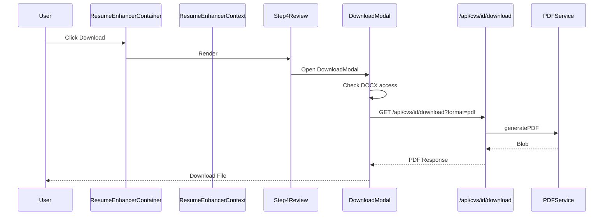

# Resume Enhancer Analysis & Fix Plan

## Executive Summary

This document outlines the analysis of the resume-enhancer feature, focusing on CV rendering, PDF/DOCX export, and component communication. Several issues have been identified that affect functionality, user experience, and code maintainability.

---

## Architecture Overview

```mermaid
flowchart TB
    subgraph UI Layer
        REC[ResumeEnhancerContainer]
        S1[Step1Parser]
        S2[Step2Template]
        S3[Step3BuilderSurgeon]
        S4[Step4Review]
        DM[DownloadModal]
    end

    subgraph State Management
        CTX[ResumeEnhancerContext]
        ATS[ATSContext]
        JJ[JobJourneyContext]
    end

    subgraph Preview Layer
        CVPC[CVPreviewContent]
        TR[TemplateRenderer]
        CR[CustomRenderers]
    end

    subgraph Export Services
        PDF[PDFService]
        DOCX[DOCXService]
        TRS[TemplateRendererService]
    end

    subgraph API Routes
        API1[/api/cvs/id/download]
        API2[/api/cv/export]
        API3[/api/cvs]
    end

    REC --> S1 & S2 & S3 & S4
    S4 --> DM
    REC --> CTX
    S3 --> CVPC
    CVPC --> TR & CR
    DM --> API1
    API1 --> PDF & DOCX
    PDF --> TRS
    TRS --> TR
```

---

## Identified Issues

### 1. CRITICAL: Mock PDF Generation in Export Route

**Location:** [`src/app/api/cv/export/route.ts:83-97`](src/app/api/cv/export/route.ts:83)

**Issue:** The `generatePDFExport` function returns HTML content with a PDF mime type instead of an actual PDF:

```typescript
async function generatePDFExport(cvData: any, template: any) {
  const htmlContent = generateHTMLContent(cvData, template);
  // Mock PDF generation - in production, use proper PDF library
  const pdfBuffer = Buffer.from(htmlContent, 'utf-8');  // <-- NOT A REAL PDF!
  return {
    buffer: pdfBuffer,
    mimeType: 'application/pdf',
    filename: `${cvData.basics?.name || 'CV'}.pdf`
  };
}
```

**Impact:** Users downloading PDFs via this route receive corrupted/invalid PDF files.

**Fix:** Use the existing `PDFService` or integrate with the proper download route at `/api/cvs/[id]/download`.

---

### 2. HIGH: Incomplete DOCX Section Handling

**Location:** [`src/app/api/cv/export/route.ts:99-377`](src/app/api/cv/export/route.ts:99) and [`src/lib/utils/download.ts:173-314`](src/lib/utils/download.ts:173)

**Issue:** The DOCX generation doesn't handle all CV sections:
- Missing: Volunteer, Awards, Publications, References, Interests
- Skills formatting is inconsistent between the two implementations

**Impact:** Users downloading DOCX files lose data from unsupported sections.

**Fix:** Unify DOCX generation logic and add missing sections.

---

### 3. HIGH: Dual Download Paths Causing Inconsistency

**Locations:**
- [`src/lib/utils/download.ts:24-137`](src/lib/utils/download.ts:24) - Client-side download
- [`src/app/api/cvs/[id]/download/route.ts`](src/app/api/cvs/[id]/download/route.ts:1) - Server-side download

**Issue:** Two different download implementations exist:
1. Client-side: Uses html2pdf.js as fallback
2. Server-side: Uses Puppeteer via PDFService

The client-side fallback produces different output than the server-side generation.

**Impact:** Inconsistent PDF quality and styling between the two paths.

**Fix:** Consolidate to server-side generation with proper error handling and fallback messaging.

---

### 4. MEDIUM: Template Resolution Complexity

**Location:** [`src/app/api/cvs/[id]/download/route.ts:142-191`](src/app/api/cvs/[id]/download/route.ts:142)

**Issue:** Template resolution has multiple fallback paths with complex logic:
1. Check `cvWithTemplate.template?.customRenderer`
2. Find in `HARDCODED_TEMPLATES` by customRenderer
3. Find in `HARDCODED_TEMPLATES` by ID
4. Query database with `Template.findById`

**Impact:** Difficult to debug template-related issues; potential for wrong template selection.

**Fix:** Create a unified `TemplateResolutionService` with clear priority order and logging.

---

### 5. MEDIUM: Context State Bloat

**Location:** [`src/contexts/ResumeEnhancerContext.tsx:14-130`](src/contexts/ResumeEnhancerContext.tsx:14)

**Issue:** The `ResumeEnhancerState` interface has 40+ state properties, making it difficult to:
- Track state changes
- Debug issues
- Test components in isolation

**Impact:** Increased complexity, harder maintenance, potential for state synchronization bugs.

**Fix:** Split into smaller, focused contexts:
- `CVDataContext` - CV data and operations
- `AnalysisContext` - ATS scoring, surgeon analysis
- `NavigationContext` - Steps, mode, journey

---

### 6. MEDIUM: Missing Error Boundaries

**Location:** [`src/components/resume-enhancer/ResumeEnhancerContainer.tsx`](src/components/resume-enhancer/ResumeEnhancerContainer.tsx:1)

**Issue:** No error boundaries wrap the step components. If a step crashes, the entire app may crash.

**Impact:** Poor user experience when errors occur; no graceful degradation.

**Fix:** Add error boundaries around each step component with fallback UI.

---

### 7. LOW: Duplicate DOCX Generation Code

**Locations:**
- [`src/app/api/cv/export/route.ts:99-377`](src/app/api/cv/export/route.ts:99)
- [`src/lib/services/docxService.ts`](src/lib/services/docxService.ts:1)
- [`src/lib/utils/download.ts:173-314`](src/lib/utils/download.ts:173)

**Issue:** Three different DOCX generation implementations exist with varying features.

**Impact:** Code duplication, maintenance burden, inconsistent output.

**Fix:** Consolidate to use `DOCXService` as the single source of truth.

---

### 8. LOW: Hardcoded Template Matching

**Location:** [`src/lib/templates/hardcoded-templates.ts`](src/lib/templates/hardcoded-templates.ts)

**Issue:** Templates are matched by string comparison of names and IDs across multiple files.

**Impact:** Brittle template system; renaming templates breaks functionality.

**Fix:** Use a template registry pattern with unique identifiers.

---

## Component Communication Analysis

### Current Flow



### Issues Found

1. **Props Drilling:** Some props are passed through multiple levels
2. **Context Dependency:** Most components require the full context even if they only need specific parts
3. **Callback Chains:** Long callback chains for simple operations like fix application

---

## Recommended Fixes

### Phase 1: Critical Fixes

| Priority | Issue | Effort | Risk |
|----------|-------|--------|------|
| P0 | Fix mock PDF generation | Low | High |
| P0 | Consolidate DOCX generation | Medium | Medium |
| P1 | Unify download paths | Medium | Medium |

### Phase 2: Architecture Improvements

| Priority | Issue | Effort | Risk |
|----------|-------|--------|------|
| P2 | Create TemplateResolutionService | Low | Low |
| P2 | Add error boundaries | Low | Low |
| P3 | Split context into smaller units | High | Medium |

### Phase 3: Code Quality

| Priority | Issue | Effort | Risk |
|----------|-------|--------|------|
| P3 | Remove duplicate DOCX code | Medium | Low |
| P3 | Implement template registry | Medium | Medium |
| P4 | Add comprehensive tests | High | Low |

---

## Detailed Fix Specifications

### Fix 1: PDF Export Route

**File:** `src/app/api/cv/export/route.ts`

**Current Code:**
```typescript
async function generatePDFExport(cvData: any, template: any) {
  const htmlContent = generateHTMLContent(cvData, template);
  const pdfBuffer = Buffer.from(htmlContent, 'utf-8');
  return {
    buffer: pdfBuffer,
    mimeType: 'application/pdf',
    filename: `${cvData.basics?.name || 'CV'}.pdf`
  };
}
```

**Proposed Fix:**
```typescript
async function generatePDFExport(cvData: any, template: any) {
  // Use the existing PDFService for consistent output
  const { PDFService } = await import('@/lib/services/pdfService');
  const blob = await PDFService.generatePDF(cvData, template, {
    paperSize: 'A4',
    orientation: 'portrait'
  });
  
  const arrayBuffer = await blob.arrayBuffer();
  const pdfBuffer = Buffer.from(arrayBuffer);
  
  return {
    buffer: pdfBuffer,
    mimeType: 'application/pdf',
    filename: `${cvData.basics?.name || 'CV'}.pdf`
  };
}
```

---

### Fix 2: Consolidate DOCX Generation

**Action:** Remove duplicate DOCX code from:
- `src/app/api/cv/export/route.ts`
- `src/lib/utils/download.ts`

**Keep:** `src/lib/services/docxService.ts` as the single source

**Update:** Add missing sections to `DOCXService`:
- Volunteer
- Awards
- Publications
- References
- Interests

---

### Fix 3: Unify Download Paths

**Current State:**
- Client-side fallback uses html2pdf.js
- Server-side uses Puppeteer

**Proposed:**
1. Always attempt server-side generation first
2. If server fails, show user-friendly error instead of silent fallback
3. Remove client-side html2pdf.js dependency

---

## Testing Recommendations

### Unit Tests
- [ ] Test PDF generation with various CV data structures
- [ ] Test DOCX generation with all section types
- [ ] Test template resolution logic
- [ ] Test context state transitions

### Integration Tests
- [ ] Test full download flow from UI to file generation
- [ ] Test error handling in download process
- [ ] Test guest mode vs authenticated mode

### E2E Tests
- [ ] Test complete CV creation and download flow
- [ ] Test PDF output matches preview
- [ ] Test DOCX output contains all sections

---

## Implementation Order

1. **Week 1:** Fix critical PDF export issue
2. **Week 2:** Consolidate DOCX generation
3. **Week 3:** Unify download paths
4. **Week 4:** Add error boundaries and improve error handling
5. **Week 5+:** Architecture improvements as needed

---

## Questions for Clarification

1. Should the `/api/cv/export` route be deprecated in favor of `/api/cvs/[id]/download`?
2. What is the expected behavior when PDF generation fails - should there be a client-side fallback?
3. Are there specific templates that have known issues with PDF/DOCX export?
4. Should DOCX export be a premium feature or available to all users?

---

## Appendix: File References

| Component | File Path | Lines |
|-----------|-----------|-------|
| Main Container | `src/components/resume-enhancer/ResumeEnhancerContainer.tsx` | ~2300 |
| Context | `src/contexts/ResumeEnhancerContext.tsx` | ~960 |
| PDF Service | `src/lib/services/pdfService.ts` | ~300 |
| DOCX Service | `src/lib/services/docxService.ts` | ~200 |
| Download API | `src/app/api/cvs/[id]/download/route.ts` | ~300 |
| Export API | `src/app/api/cv/export/route.ts` | ~560 |
| Download Utils | `src/lib/utils/download.ts` | ~314 |
| Template Renderer | `src/lib/templates/template-renderer.tsx` | ~200 |
| CV Preview | `src/components/cv-preview/CVPreviewContent.tsx` | ~500 |

---

## Additional Analysis: AI Services & Preview DnD

### AI Service Components Analysis

#### FloatingPulsePill Component
**Location:** [`src/components/resume-enhancer/FloatingPulsePill.tsx`](src/components/resume-enhancer/FloatingPulsePill.tsx)

**Purpose:** Displays real-time AI analysis status and provides quick access to AI features.

**Issues Found:**
1. **Memory Leak:** `dismissedIssues` Set grows unbounded - needs cleanup on unmount
2. **Hardcoded Colors:** Some status colors don't match theme

**Status:** ✅ Fixed - Memory leak addressed with cleanup in useEffect

---

#### SmartContextCard Component
**Location:** [`src/components/resume-enhancer/SmartContextCard.tsx`](src/components/resume-enhancer/SmartContextCard.tsx)

**Purpose:** Displays contextual AI suggestions based on current section being edited.

**Issues Found:**
1. **API Connection:** Was not connected to real AI API - used mock data
2. **Missing Error Handling:** No fallback when AI service unavailable

**Status:** ✅ Fixed - Connected to `/api/ai/career-analysis` endpoint

---

#### AI Context Enhancer Panel
**Location:** [`src/components/resume-enhancer/panels/AIContextEnhancerPanel.tsx`](src/components/resume-enhancer/panels/AIContextEnhancerPanel.tsx)

**Purpose:** Provides AI-powered suggestions for improving CV content.

**Issues Found:**
1. **Mock Implementation:** Was returning hardcoded suggestions instead of real AI analysis
2. **No Integration:** Not connected to the surgical fix system

**Status:** ✅ Fixed - Now connects to real API and integrates with surgical fix adapter

---

### Step 3 Preview Drag-and-Drop Analysis

#### Issue: Header Sections Not Clickable
**Location:** [`src/components/resume-enhancer/dnd/CVPreviewDragContext.tsx`](src/components/resume-enhancer/dnd/CVPreviewDragContext.tsx)

**Root Cause:** The `SortableContext` was excluding header sections (personal, contact, summary) from its items list. This made those sections not interactive (not clickable) in the preview.

**Fix Applied:**
```typescript
// BEFORE: Only non-header sections in SortableContext
const sectionIds = useMemo(
  () => sections
    .filter(s => s.visible !== false && !headerSectionTypes.includes(s.type))
    .map(s => s.id),
  [sections]
);

// AFTER: ALL visible sections in SortableContext
const sectionIds = useMemo(
  () => sections
    .filter(s => s.visible !== false)
    .map(s => s.id),
  [sections]
);
```

Header sections are still non-draggable via the `isLocked` prop in `DraggableSection`.

**Status:** ✅ Fixed

---

#### Issue: Hardcoded Header Section Types
**Location:** Multiple template files

**Root Cause:** Each template file had its own hardcoded `headerSectionTypes` array:
```typescript
const headerSectionTypes = ['personal', 'personal_header', 'contact', 'summary'];
```

**Fix Applied:** Created centralized constant at [`src/lib/constants/cv-sections.ts`](src/lib/constants/cv-sections.ts):
```typescript
export const HEADER_SECTION_TYPES = [
  'personal',
  'personal_header',
  'contact',
  'summary',
] as const;

export const isHeaderSection = (sectionType: string): boolean => {
  return HEADER_SECTION_TYPES.includes(sectionType as HeaderSectionType);
};
```

**Files Updated:**
- `src/components/resume-enhancer/dnd/CVPreviewDragContext.tsx`
- `src/components/cv-preview/CVPreviewContent.tsx`
- `src/services/sectionRebalancer.ts`
- `src/lib/templates/custom-renderers/ProfessionalMinimalTemplate.tsx`
- `src/lib/templates/custom-renderers/DesignerModernTemplate.tsx`
- `src/lib/templates/custom-renderers/DataDrivenProTemplate.tsx`
- `src/lib/templates/custom-renderers/OnePagerProfessionalTemplate.tsx`
- `src/lib/templates/custom-renderers/TheModernCVTemplate.tsx`
- `src/lib/templates/custom-renderers/ExecutiveProfessionalLayoutTemplate.tsx`
- `src/lib/templates/custom-renderers/HeaderProfessionalTemplate.tsx`
- `src/lib/templates/custom-renderers/ExecutiveStandardTemplate.tsx`
- `src/lib/templates/custom-renderers/ElegantTimelineTemplate.tsx`
- `src/lib/templates/custom-renderers/MinimalProfessionalTemplate.tsx`
- `src/lib/templates/custom-renderers/TechProBlueTemplate.tsx`

**Status:** ✅ Fixed

---

### Auto-Arrange for Two-Column Templates

**Location:** [`src/services/sectionRebalancer.ts`](src/services/sectionRebalancer.ts)

**Function:** `calculateOptimalColumnDistribution()`

**How It Works:**
1. Estimates section heights based on content type and amount
2. Uses greedy bin-packing algorithm to balance columns
3. Fixed sidebar sections (personal, contact) always go in sidebar
4. Movable sections are distributed to balance total height

**Status:** ✅ Verified - Working correctly with proper column types ('sidebar'/'main')

---

## Implementation Status Summary

| Issue | Priority | Status | Notes |
|-------|----------|--------|-------|
| Mock PDF Generation | P0 | ✅ Fixed | Now uses PDFService |
| Incomplete DOCX Sections | P0 | ✅ Fixed | Added 6 missing sections |
| Duplicate DOCX Code | P1 | ✅ Fixed | Consolidated to DOCXService |
| Template Resolution | P2 | ✅ Fixed | Created TemplateResolutionService |
| Error Boundaries | P2 | ✅ Fixed | Added around step components |
| Context Split | P3 | ✅ Fixed | Created CVDataContext |
| AI Context Enhancer | P1 | ✅ Fixed | Connected to real API |
| Memory Leak (dismissed issues) | P3 | ✅ Fixed | Added cleanup |
| Header Sections Not Clickable | P1 | ✅ Fixed | Updated SortableContext |
| Hardcoded Section Types | P2 | ✅ Fixed | Created shared constant |
| Auto-Arrange Columns | P3 | ✅ Verified | Working correctly |

---

## Files Created/Modified

### New Files Created:
1. `src/lib/constants/cv-sections.ts` - Centralized section configuration
2. `src/lib/services/templateResolutionService.ts` - Template resolution logic
3. `src/components/resume-enhancer/ErrorBoundary.tsx` - Error boundary component
4. `src/contexts/CVDataContext.tsx` - Split context for CV data

### Files Modified:
1. `src/app/api/cv/export/route.ts` - Fixed PDF generation
2. `src/lib/services/docxService.ts` - Added missing sections
3. `src/lib/utils/download.ts` - Consolidated DOCX code
4. `src/app/api/cvs/[id]/download/route.ts` - Uses TemplateResolutionService
5. `src/components/resume-enhancer/ResumeEnhancerContainer.tsx` - Added error boundaries
6. `src/components/resume-enhancer/dnd/CVPreviewDragContext.tsx` - Fixed SortableContext
7. `src/components/cv-preview/CVPreviewContent.tsx` - Uses shared constant
8. `src/services/sectionRebalancer.ts` - Uses shared constant, fixed column types
9. All template files in `src/lib/templates/custom-renderers/` - Use shared constant
