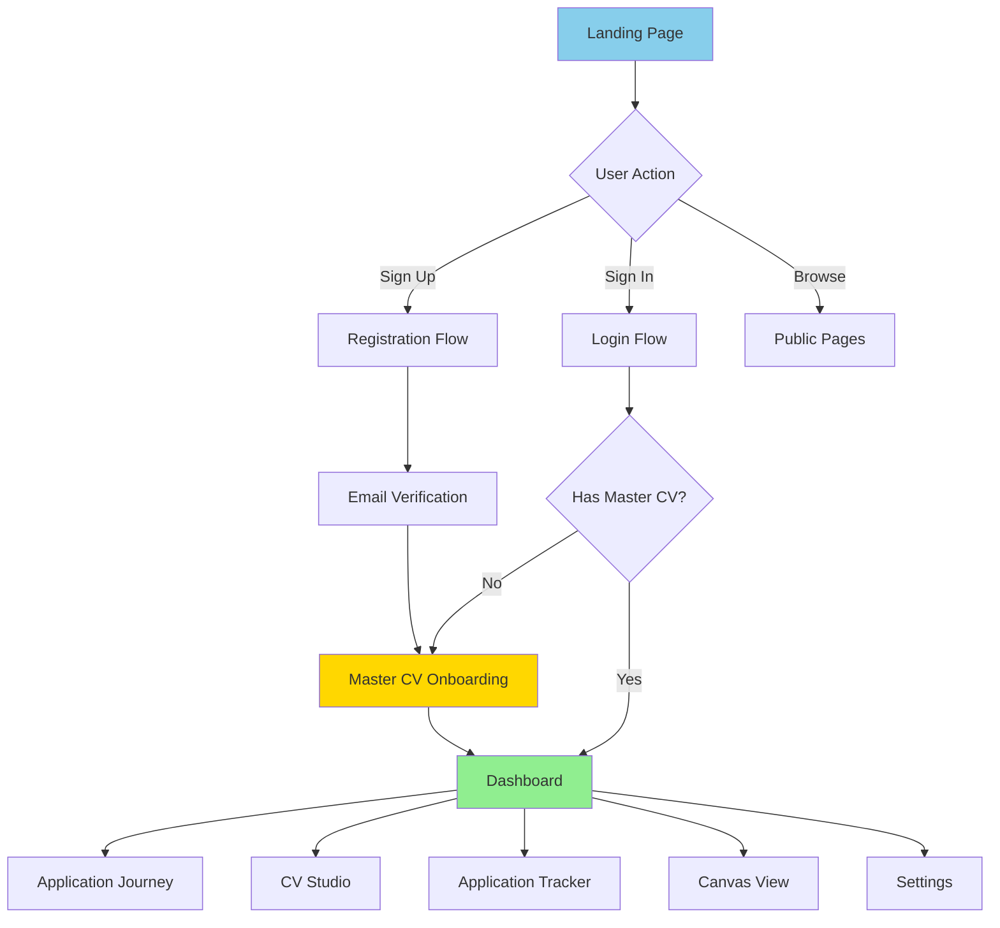
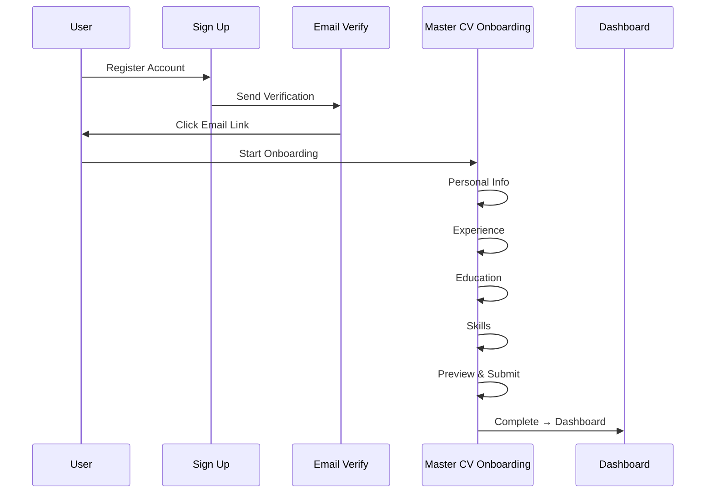
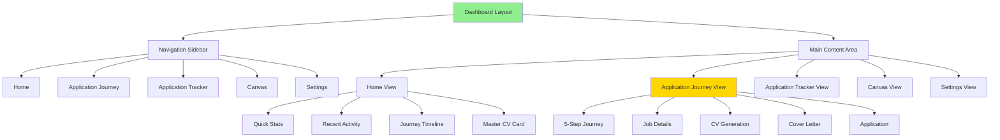
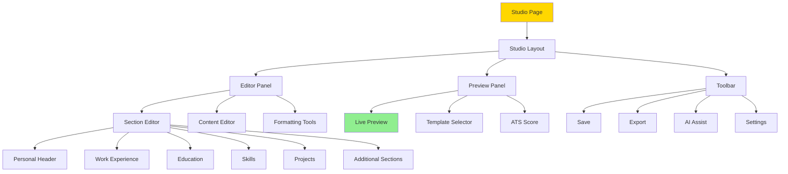
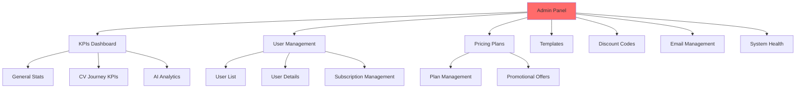
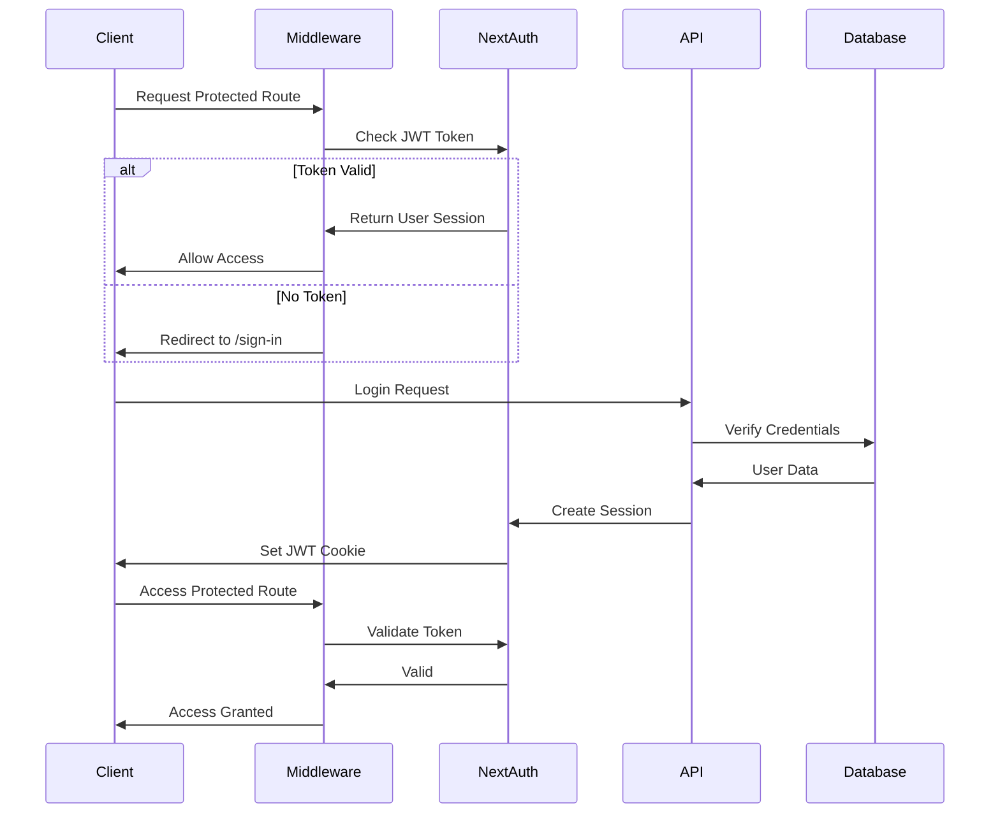
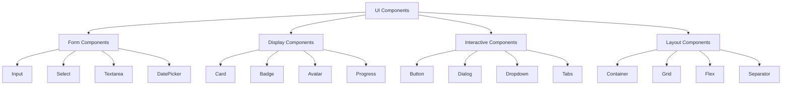
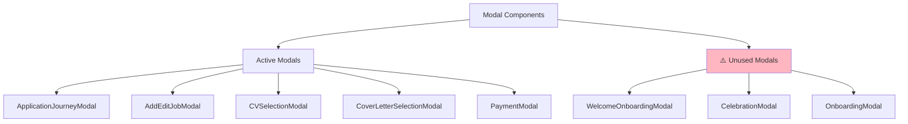
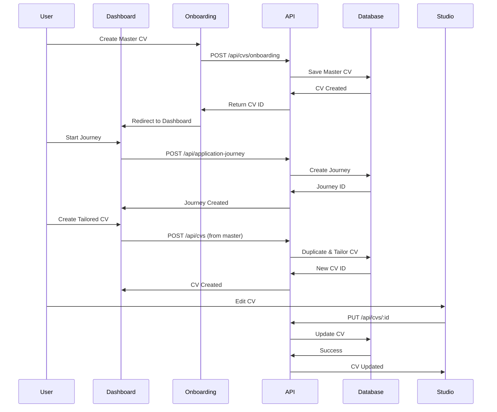

# CVCircle.io Application Structure Guide

## Table of Contents
1. [Application Overview](#application-overview)
2. [Page Structure](#page-structure)
3. [Authentication Flow](#authentication-flow)
4. [Dashboard Flow](#dashboard-flow)
5. [CV Creation Flow](#cv-creation-flow)
6. [Component Hierarchy](#component-hierarchy)
7. [API Routes](#api-routes)
8. [Unused Components (To Remove)](#unused-components-to-remove)

---

## Application Overview



---

## Page Structure

### 1. Public Pages

```mermaid
graph LR
    A[/ - Landing Page] --> B[/sign-in - Login]
    A --> C[/sign-up - Registration]
    A --> D[/privacy-policy]
    A --> E[/terms]
    A --> F[/cookie-policy]
    
    B --> G[/auth/verify-email]
    B --> H[/auth/reset-password]
    B --> I[/auth/error]
    
    C --> G
    
    style A fill:#87CEEB
    style B fill:#FFD700
    style C fill:#FFD700
```

**Files:**
- `src/app/page.tsx` - Landing page with hero, features, pricing
- `src/app/sign-in/[[...sign-in]]/page.tsx` - Login page
- `src/app/sign-up/[[...sign-up]]/page.tsx` - Registration page
- `src/app/auth/verify-email/page.tsx` - Email verification
- `src/app/auth/reset-password/page.tsx` - Password reset
- `src/app/privacy-policy/page.tsx` - Privacy policy
- `src/app/terms/page.tsx` - Terms of service
- `src/app/cookie-policy/page.tsx` - Cookie policy

---

### 2. Onboarding Flow



**Files:**
- `src/app/master-cv-onboarding/page.tsx` - Main onboarding page
- `src/components/onboarding/MasterCVCreationWizard.tsx` - Wizard component
- `src/components/onboarding/PersonalInfoStep.tsx` - Step 1
- `src/components/onboarding/ExperienceStep.tsx` - Step 2
- `src/components/onboarding/EducationStep.tsx` - Step 3
- `src/components/onboarding/steps/SkillsStep.tsx` - Step 4
- `src/components/onboarding/CompletionStep.tsx` - Step 5

**⚠️ UNUSED (To Remove):**
- `src/app/onboarding/` - Old onboarding (deprecated)
- `src/app/onboarding-universal/` - Alternative onboarding (not used)
- `src/components/onboarding-universal/` - Alternative components (not used)
- `src/components/onboarding/WelcomeModal.tsx` - Not used
- `src/components/onboarding/AuthModal.tsx` - Replaced by main auth

---

### 3. Dashboard Structure



**Files:**
- `src/app/dashboard/layout.tsx` - Dashboard layout wrapper
- `src/app/dashboard/page.tsx` - Dashboard home
- `src/app/dashboard/application-journey/page.tsx` - Journey view
- `src/app/dashboard/application-tracker/page.tsx` - Tracker view
- `src/app/dashboard/canvas/page.tsx` - Canvas view
- `src/app/dashboard/settings/page.tsx` - Settings
- `src/app/dashboard/vault/page.tsx` - Vault (document storage)

**Components:**
- `src/components/dashboard/DashboardNavigation.tsx` - Sidebar nav
- `src/components/dashboard/CVCard.tsx` - CV card display
- `src/components/dashboard/JourneyTimelineCard.tsx` - Timeline widget
- `src/components/dashboard/ApplicationStatsWidget.tsx` - Stats widget
- `src/components/dashboard/RecentActivityWidget.tsx` - Activity feed

**⚠️ UNUSED (To Remove):**
- `src/app/dashboard/pipeline/` - Old pipeline view
- `src/app/dashboard/premium-job-tracker/` - Replaced by application-tracker
- `src/app/dashboard/quillbox/` - Not implemented
- `src/app/dashboard/inkpad/page.tsx` - Duplicate/unused
- `src/components/dashboard/DashboardRouter.tsx` - Not used
- `src/components/dashboard/LoadingDashboard.tsx` - Using Suspense now

---

### 4. CV Studio



**Files:**
- `src/app/studio/page.tsx` - Studio page wrapper
- `src/components/studio/CVStudio.tsx` - Main studio component
- `src/components/studio/EditorPanel.tsx` - Editor UI
- `src/components/studio/PreviewPanel.tsx` - Preview UI
- `src/components/studio/Toolbar.tsx` - Toolbar UI

**Section Components:**
- `src/components/cv-sections/PersonalHeader.tsx`
- `src/components/cv-sections/WorkExperience.tsx`
- `src/components/cv-sections/Education.tsx`
- `src/components/cv-sections/Skills.tsx`
- `src/components/cv-sections/Projects.tsx`
- `src/components/cv-sections/Awards.tsx`
- `src/components/cv-sections/Certificates.tsx`
- `src/components/cv-sections/Languages.tsx`
- `src/components/cv-sections/Publications.tsx`
- `src/components/cv-sections/Volunteer.tsx`

**53 Studio Components** - All active and in use

---

### 5. Admin Panel



**Files:**
- `src/app/admin/page.tsx` - Admin dashboard
- `src/app/admin/email-management/page.tsx` - Email management
- `src/components/admin/AdminKPIs.tsx` - KPI dashboard
- `src/components/admin/UserManagement.tsx` - User management
- `src/components/admin/PricingPlanManager.tsx` - Pricing management
- `src/components/admin/TemplateManager.tsx` - Template management
- `src/components/admin/DiscountCodeManager.tsx` - Discount management
- `src/components/admin/SystemHealth.tsx` - System monitoring

---

## Authentication Flow



**Authentication Files:**
- `src/middleware.ts` - Route protection
- `src/lib/auth.ts` - NextAuth configuration
- `src/lib/auth-minimal.ts` - Minimal auth config
- `src/app/api/auth/[...nextauth]/route.ts` - NextAuth handler
- `src/app/api/auth/login/route.ts` - Custom login
- `src/app/api/auth/register/route.ts` - Custom registration
- `src/app/api/auth/logout/route.ts` - Logout endpoint
- `src/lib/utils/signout.ts` - Signout utilities

**⚠️ UNUSED (To Remove):**
- `src/app/api/auth/firebase/` - Firebase auth (if using NextAuth only)
- `src/app/api/auth/sync-clerk-user/` - Clerk integration (not used)
- `src/app/api/test-firebase-auth/` - Test files
- `src/components/auth/TwoFactorModal.tsx` - 2FA not implemented
- `src/components/auth/GoogleOneTap.tsx` - Google One Tap not used
- `src/components/auth/FirebaseAuth.tsx` - If using NextAuth only

---

## API Routes Structure

### Core API Routes (Active)

```mermaid
graph TB
    API[/api] --> Auth[/auth - Authentication]
    API --> User[/user - User Management]
    API --> CVs[/cvs - CV Management]
    API --> CL[/cover-letters - Cover Letters]
    API --> Jobs[/jobs - Job Applications]
    API --> Journey[/application-journey - Journey Management]
    API --> AI[/ai - AI Services]
    API --> Admin[/admin - Admin Functions]
    API --> Payment[/payment - Payments]
    API --> Webhooks[/webhooks - Webhooks]
    
    Auth --> A1[/login]
    Auth --> A2[/register]
    Auth --> A3[/logout]
    Auth --> A4[/refresh]
    
    CVs --> C1[GET/POST /cvs]
    CVs --> C2[GET/PUT/DELETE /cvs/:id]
    CVs --> C3[/cvs/duplicate]
    CVs --> C4[/cvs/master]
    
    AI --> AI1[/ats-score]
    AI --> AI2[/generate-cover-letter]
    AI --> AI3[/improve-content]
    AI --> AI4[/parse-cv]
    
    style API fill:#87CEEB
    style Auth fill:#90EE90
    style CVs fill:#FFD700
    style AI fill:#FF6B6B
```

**API Route Counts:**
- Auth routes: 16 endpoints
- CV management: 12 endpoints
- AI services: 23 endpoints
- User management: 18 endpoints
- Admin: 25 endpoints
- **Total: ~150 API routes**

### Unused API Routes (To Remove)

```
⚠️ REMOVE THESE:
- /api/beta-signup/ - Not used
- /api/documents/[id]/ - Duplicate of CVs
- /api/jobs/parsed/ - Not implemented
- /api/dashboard/pipeline/ - Old pipeline
- /api/cv-parser/ - Duplicate functionality
- /api/cv-sessions/ - Not used
```

---

## Component Hierarchy

### UI Components (32 files)



**All 32 UI components are ACTIVE and used throughout the app.**

### Modal Components



**⚠️ UNUSED Modals (To Remove):**
- `src/components/modals/WelcomeOnboardingModal.tsx` - Not used
- `src/components/modals/CelebrationModal.tsx` - Not implemented
- `src/components/modals/OnboardingModal.tsx` - Replaced by wizard

---

## Data Flow

### CV Creation & Management



---

## File Structure Summary

### Active Files Breakdown

```
src/
├── app/                     # Next.js pages
│   ├── page.tsx            # Landing page ✅
│   ├── dashboard/          # Dashboard pages ✅
│   │   ├── page.tsx
│   │   ├── application-journey/  ✅
│   │   ├── application-tracker/  ✅
│   │   ├── canvas/              ✅
│   │   ├── settings/            ✅
│   │   ├── vault/               ✅
│   │   ├── inkpad/              ❌ REMOVE
│   │   ├── pipeline/            ❌ REMOVE
│   │   └── premium-job-tracker/ ❌ REMOVE
│   ├── studio/             # CV Studio ✅
│   ├── admin/              # Admin panel ✅
│   ├── master-cv-onboarding/  ✅
│   ├── onboarding/         ❌ REMOVE (deprecated)
│   ├── onboarding-universal/  ❌ REMOVE (not used)
│   ├── sign-in/            ✅
│   ├── sign-up/            ✅
│   ├── auth/               ✅
│   ├── force-logout/       ✅
│   └── api/                # API routes (~150 endpoints)
│
├── components/
│   ├── dashboard/          # 24 components ✅
│   ├── studio/             # 53 components ✅
│   ├── landing/            # 10 components ✅
│   ├── auth/               # 10 components (8 active, 2 unused)
│   ├── onboarding/         # 13 components (10 active, 3 unused)
│   ├── onboarding-universal/  ❌ REMOVE (6 components)
│   ├── modals/             # 9 components (6 active, 3 unused)
│   ├── ui/                 # 32 components ✅
│   ├── admin/              # 16 components ✅
│   ├── payment/            # 6 components ✅
│   └── cv-sections/        # 11 components ✅
│
└── lib/                    # Utilities & services ✅
```

---

## Unused Components Summary (To Remove)

### Pages (3 folders)
1. `src/app/onboarding/` - Deprecated onboarding
2. `src/app/onboarding-universal/` - Alternative onboarding not used
3. `src/app/dashboard/pipeline/` - Old pipeline view
4. `src/app/dashboard/premium-job-tracker/` - Replaced
5. `src/app/dashboard/quillbox/` - Not implemented
6. `src/app/dashboard/inkpad/` - Duplicate

### Components (15 files)
1. `src/components/onboarding-universal/` - 6 components
2. `src/components/onboarding/WelcomeModal.tsx`
3. `src/components/onboarding/AuthModal.tsx`
4. `src/components/modals/WelcomeOnboardingModal.tsx`
5. `src/components/modals/CelebrationModal.tsx`
6. `src/components/modals/OnboardingModal.tsx`
7. `src/components/auth/TwoFactorModal.tsx`
8. `src/components/auth/GoogleOneTap.tsx`
9. `src/components/auth/FirebaseAuth.tsx` (if NextAuth only)
10. `src/components/dashboard/DashboardRouter.tsx`
11. `src/components/dashboard/LoadingDashboard.tsx`

### API Routes (6 folders)
1. `src/app/api/beta-signup/`
2. `src/app/api/documents/[id]/`
3. `src/app/api/jobs/parsed/`
4. `src/app/api/cv-sessions/`
5. `src/app/api/auth/firebase/` (if NextAuth only)
6. `src/app/api/auth/sync-clerk-user/`
7. `src/app/api/test-firebase-auth/`

### Scripts (Potentially unused)
Check `scripts/` folder for migration scripts that are no longer needed after initial setup.

---

## Next Steps for Cleanup

### Phase 1: Safe Removal (No Breaking Changes)
1. Remove deprecated onboarding pages
2. Remove unused modal components
3. Remove old dashboard pages
4. Remove test/beta API routes

### Phase 2: Auth Cleanup (Be Careful)
1. Determine if using Firebase OR NextAuth (not both)
2. Remove unused auth provider
3. Clean up auth components

### Phase 3: API Cleanup
1. Remove duplicate API routes
2. Consolidate similar endpoints
3. Update documentation

### Phase 4: Optimization
1. Review and optimize remaining components
2. Add lazy loading where needed
3. Implement code splitting

---

## Current Authentication Issue

**Problem:** User remains logged in after logout

**Root Cause:** NextAuth JWT token stored in HTTP-only cookie

**Cookie Name:** `next-auth.session-token`

**Solution Required:**
1. Clear NextAuth cookies server-side
2. Clear all browser storage client-side
3. Force token revocation

**Files Involved:**
- `src/middleware.ts` - Uses `getToken()` to check JWT
- `src/lib/session.ts` - Cookie clearing
- `src/app/api/auth/logout/route.ts` - Logout API
- `src/lib/utils/signout.ts` - Client-side logout

---

## Conclusion

**Total Files:** ~535 TypeScript/TSX files
**Active:** ~480 files (90%)
**Unused:** ~55 files (10%)

**Recommendation:** Remove unused components to:
1. Reduce bundle size
2. Improve build times
3. Simplify maintenance
4. Reduce confusion

Would you like me to proceed with creating a cleanup script to safely remove these unused files?

