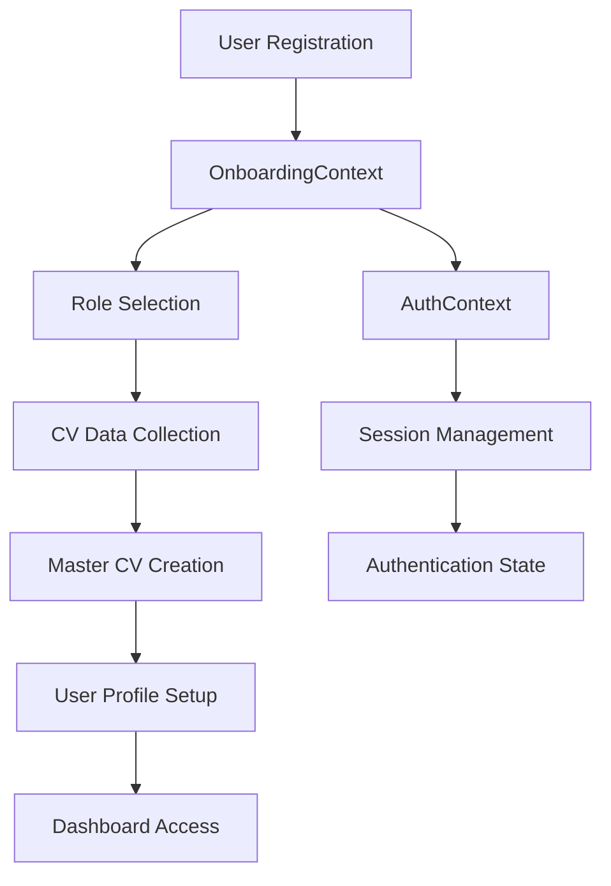
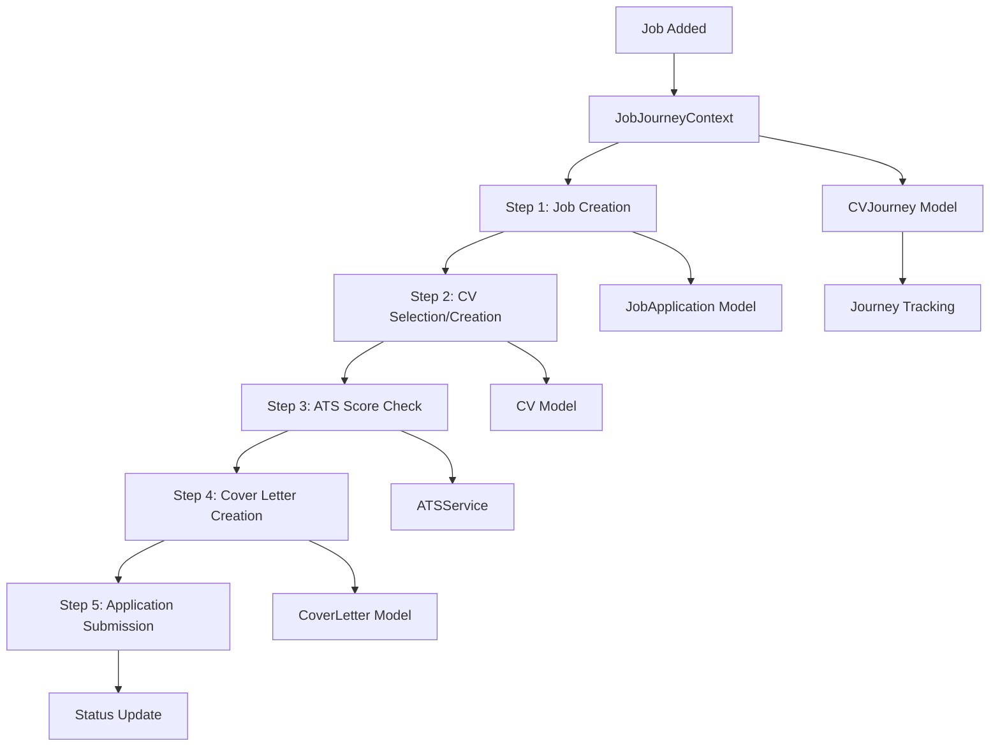
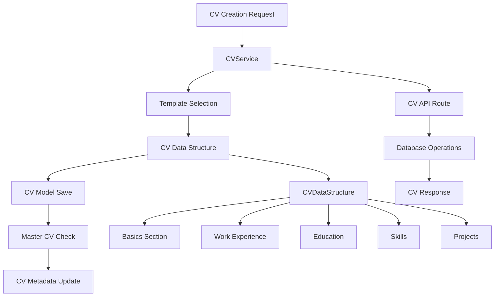
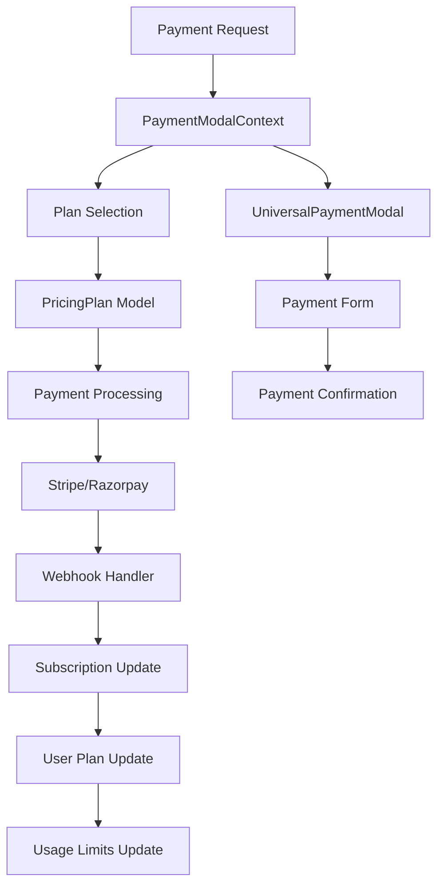
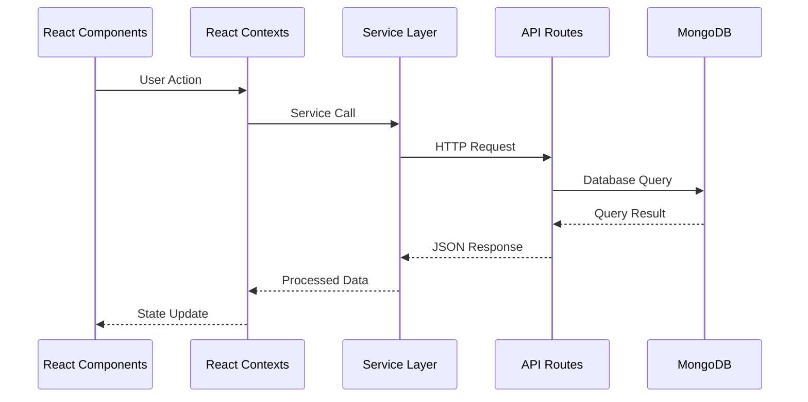
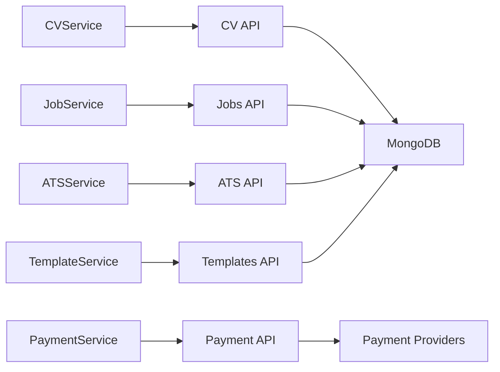
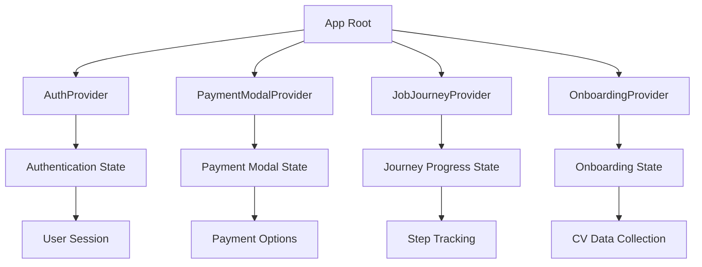

# Circle CV App - Data Flow & Relationships Diagram

## Overview
This document provides a comprehensive view of how data flows through your Circle CV application, showing the relationships between different entities and the data flow patterns.

## Core Data Models & Relationships

```mermaid
erDiagram
    USER ||--o{ CV : creates
    USER ||--o{ JOB_APPLICATION : applies_to
    USER ||--o{ COVER_LETTER : writes
    USER ||--o{ CV_JOURNEY : tracks
    USER ||--o{ SUBSCRIPTION : has
    USER ||--o{ INVOICE : receives
    USER ||--o{ PAYMENT_METHOD : uses
    
    CV ||--o{ JOB_APPLICATION : linked_to
    CV ||--o{ COVER_LETTER : based_on
    CV ||--o{ CV_JOURNEY : part_of
    CV }o--|| TEMPLATE : uses
    
    JOB_APPLICATION ||--o{ CV_JOURNEY : creates
    JOB_APPLICATION ||--o{ COVER_LETTER : generates
    
    TEMPLATE ||--o{ CV : instantiated_as
    PRICING_PLAN ||--o{ SUBSCRIPTION : defines
    SUBSCRIPTION ||--o{ INVOICE : generates
    
    USER {
        ObjectId _id PK
        string email UK
        string password
        string firebaseUid UK
        string firstName
        string lastName
        string username UK
        string avatar
        string role
        boolean isEmailVerified
        string currentPlanKey FK
        number monthlyGoal
        object usage
        object subscription
        object settings
        date createdAt
        date updatedAt
    }
    
    CV {
        ObjectId _id PK
        ObjectId userId FK
        string title
        object cvData
        string status
        number version
        boolean isMaster
        ObjectId templateId FK
        string templateName
        object templateData
        object styling
        object metadata
        date createdAt
        date updatedAt
    }
    
    JOB_APPLICATION {
        ObjectId _id PK
        ObjectId userId FK
        ObjectId cvId FK
        string jobTitle
        string company
        string jobUrl
        string jobDescription
        string sponsorship
        string location
        object salary
        string status
        string priority
        date applicationDate
        date deadline
        string notes
        array contacts
        array interviews
        array followUps
        array attachments
        array tags
        boolean isArchived
        date createdAt
        date updatedAt
    }
    
    COVER_LETTER {
        ObjectId _id PK
        string userId FK
        string title
        string content
        string status
        string cvId FK
        string jobId FK
        object metadata
        date createdAt
        date updatedAt
    }
    
    CV_JOURNEY {
        ObjectId _id PK
        string userId FK
        string jobId FK
        string cvId FK
        string coverLetterId FK
        string status
        number currentStep
        number totalSteps
        number atsScore
        string atsScoreJobId FK
        string jobTitle
        string company
        array steps
        object metadata
        date createdAt
        date updatedAt
    }
    
    TEMPLATE {
        ObjectId _id PK
        string name
        string description
        string thumbnail
        string category
        array categories
        string tier
        object globalStyles
        array availableSections
        object templateData
        boolean isActive
        boolean isDefault
        boolean isPublished
        boolean globalAccess
        number version
        ObjectId createdBy FK
        date createdAt
        date updatedAt
    }
    
    PRICING_PLAN {
        ObjectId _id PK
        string key UK
        string name
        string description
        number price_monthly
        number price_quarterly
        number price_yearly
        number price_one_time
        string currency
        string billingCycle
        number maxCVs
        number maxExports
        number storageLimit
        array features
        string status
        boolean isPopular
        boolean isBestValue
        number sortOrder
        string stripePriceId_monthly
        string stripePriceId_quarterly
        string stripePriceId_yearly
        string stripePriceId_one_time
        string razorpayPlanId_monthly
        string razorpayPlanId_quarterly
        string razorpayPlanId_yearly
        number dayPassDuration
        date createdAt
        date updatedAt
    }
    
    SUBSCRIPTION {
        ObjectId _id PK
        ObjectId userId FK
        string planKey FK
        string status
        date startDate
        date endDate
        date currentPeriodStart
        date currentPeriodEnd
        string provider
        string providerSubscriptionId
        string providerCustomerId
        string interval
        number seats
        number storageUsed
        date createdAt
        date updatedAt
    }
    
    INVOICE {
        ObjectId _id PK
        ObjectId userId FK
        ObjectId subscriptionId FK
        string invoiceNumber UK
        number amount
        string currency
        string status
        date dueDate
        date paidDate
        string paymentMethod
        string providerInvoiceId
        object lineItems
        date createdAt
        date updatedAt
    }
    
    PAYMENT_METHOD {
        ObjectId _id PK
        ObjectId userId FK
        string type
        string provider
        string providerPaymentMethodId
        object metadata
        boolean isDefault
        date createdAt
        date updatedAt
    }
```

## Data Flow Patterns

### 1. User Onboarding Flow

### 2. Job Application Journey Flow

### 3. CV Creation & Management Flow

### 4. Payment & Subscription Flow

## API Data Flow Architecture

### Frontend to Backend Communication

### Key Service Interactions

## State Management Flow

### Context Hierarchy

## Data Relationships Summary

### Primary Relationships:
1. **User** → **CV**: One-to-Many (User can have multiple CVs)
2. **User** → **JobApplication**: One-to-Many (User can apply to multiple jobs)
3. **CV** → **JobApplication**: One-to-Many (CV can be used for multiple applications)
4. **JobApplication** → **CVJourney**: One-to-One (Each job creates a journey)
5. **CV** → **Template**: Many-to-One (Multiple CVs can use same template)
6. **User** → **Subscription**: One-to-One (User has one active subscription)

### Key Data Flows:
1. **Onboarding**: User → OnboardingContext → CV Creation → Master CV
2. **Job Application**: Job Added → CV Selection → ATS Check → Cover Letter → Application
3. **CV Management**: Template Selection → Data Entry → Styling → Export
4. **Payment**: Plan Selection → Payment Processing → Subscription Update → Usage Tracking

### Critical Data Links:
- `User.currentPlanKey` → `PricingPlan.key`
- `CV.userId` → `User._id`
- `JobApplication.cvId` → `CV._id`
- `CVJourney.jobId` → `JobApplication._id`
- `CV.templateId` → `Template._id`
- `Subscription.userId` → `User._id`

This architecture ensures data consistency and provides a clear path for user interactions through the application.
